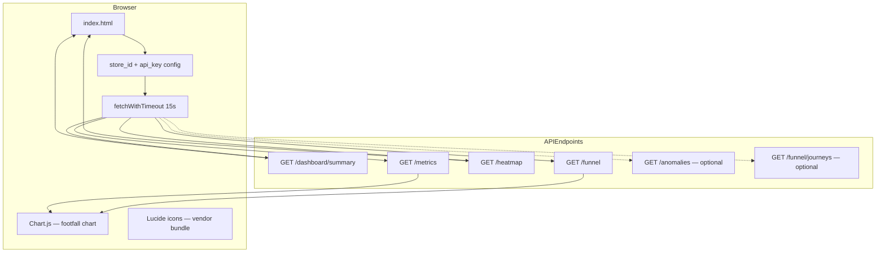

# Store Intelligence — System Design

**Version:** Phase 1 (Round 2 submission)  
**Audience:** Purple Tech reviewers, solution architects, engineers extending the platform

---

## Executive Summary

Store Intelligence converts **offline CCTV footage** and **POS transaction CSVs** into **retail business metrics**: footfall, zone heatmaps, conversion funnels, purchase linkage, and operational anomalies. Phase 1 delivers a production-shaped **monolith**: FastAPI + PostgreSQL + offline YOLO pipeline + static dashboard.

**What works today (Phase 1):**

- YOLOv11 + ByteTrack detection on Brigade Road MP4s (or committed bootstrap JSONL for instant demo)
- Flat `vision.*` event ingest with idempotency and deduplication
- On-read BI: funnel, heatmap, anomalies, metrics, dashboard summary
- POS ingest and heuristic CCTV→POS journey linkage
- Docker Compose one-command startup with auto-migration, seed, bootstrap, and POS ingest
- 280 automated tests; CI enforces ≥96% branch coverage on `app/`

**What is explicitly Phase 2:**

- Live RTSP ingest, Redis Streams, MinIO frame archive, distributed GPU workers
- JWT/OAuth, multi-tenant isolation, Kubernetes deployment
- ML-based anomaly detection (Phase 1 uses deterministic rules)

The system does **not** fabricate dashboard KPIs. All numbers are computed from PostgreSQL rows at request time (or from pre-projected `store_metrics` when available).

---

## Detailed Architecture

This section is the primary architecture reference for reviewers and engineers. It follows **C4 model** levels (Context → Container → Component) plus deployment, data, and request-flow views. All diagrams reflect the **actual Phase 1 codebase**.

```text
Smart-AI-StoreSurveillance/          # Store Intelligence — CCTV → retail analytics (Phase 1)
│
├── pipeline/                        # Offline CV worker (separate from API)
│   ├── detect.py                    # YOLOv11 person detection (+ mock mode for CI/dev)
│   ├── tracker.py                   # ByteTrack multi-camera tracking → external_track_id
│   ├── zones.yaml                   # Per-camera polygon ROIs (entry, browse, billing_queue)
│   ├── emit.py                      # Flat vision.* event builder + idempotency keys
│   ├── run.py                       # Main CLI — process clips → POST /events/ingest
│   ├── run.sh                       # One command wrapper (all cameras / ingest flags)
│   ├── config.yaml                  # Frame stride, sample_fps, re-entry cooldown, emit intervals
│   ├── config.py                    # PipelineConfig loader
│   ├── videos.py                    # Discover MP4s under data/videos/
│   ├── ingest.py                    # HTTP batch poster to FastAPI ingest API
│   └── report.py                    # ProcessingRunReport (markdown evidence)
│
├── app/                             # FastAPI backend (hexagonal / layered)
│   ├── main.py                      # FastAPI entrypoint, routers, dashboard mount, lifespan bootstrap
│   ├── config.py                    # pydantic-settings (DATABASE_URL, API_KEY, REVIEWER_MODE, …)
│   ├── database.py                  # Async SQLAlchemy engine + session factory
│   ├── dependencies.py              # FastAPI DI — wire repos + services per request
│   ├── security.py                  # X-API-Key auth (purple-demo-key in reviewer mode)
│   │
│   ├── routers/                     # HTTP + WebSocket inbound adapters
│   │   ├── events.py                # POST /api/v1/events/ingest (single + batch)
│   │   ├── stores.py                # metrics, funnel, heatmap, anomalies, dashboard/summary
│   │   ├── health.py                # GET /health, /health/ready
│   │   ├── reviewer.py              # GET /reviewer, /reviewer/api (public proof checklist)
│   │   └── ws.py                    # WS /ws/stores/{id}/live (5s BI snapshots)
│   │
│   ├── services/                    # Application orchestration layer
│   │   ├── event_ingestion_service.py   # Ingest, dedup, partial batch success  ← ingestion.py
│   │   ├── event_validation_service.py    # Pydantic validation per event_type
│   │   ├── analytics_service.py           # Footfall time series (store_metrics + fallback) ← metrics.py
│   │   ├── funnel_service.py              # Funnel + session + POS linkage orchestration ← funnel.py
│   │   ├── heatmap_service.py               # Zone visits + dwell aggregation
│   │   ├── anomaly_service.py             # Baseline compare + rule engine           ← anomalies.py
│   │   ├── dashboard_service.py             # Composes all BI into KPI cards
│   │   ├── metrics_projector_service.py     # Writes hourly footfall on ingest
│   │   ├── health_service.py              # DB ping + feed freshness
│   │   ├── pos_ingestion_service.py       # POS CSV → transactions
│   │   └── cctv_bootstrap.py              # Load committed YOLO bootstrap JSONL
│   │
│   ├── domain/                      # Pure business logic (no I/O)
│   │   ├── funnel/
│   │   │   ├── calculator.py        # First-touch funnel, conversion, re-entry counts
│   │   │   ├── pos_linker.py        # CCTV billing track ↔ POS order time window
│   │   │   └── stages.py            # ENTRY → ZONE_VISIT → BILLING_QUEUE → PURCHASE
│   │   ├── heatmap/
│   │   │   └── calculator.py        # Zone visit counts, dwell, normalized scores
│   │   ├── anomaly/
│   │   │   └── detector.py          # QUEUE_SPIKE, CONVERSION_DROP, DEAD_ZONE, STALE_FEED
│   │   ├── vision/
│   │   │   └── visitor_count.py     # Distinct visitor / track counting
│   │   └── dashboard/
│   │       ├── kpi_queries.py       # Dashboard KPI SQL
│   │       ├── coverage.py          # Cameras / videos / frames provenance
│   │       └── period.py            # Analysis window (first event → now)
│   │
│   ├── schemas/                     # Pydantic request/response DTOs              ← models.py (API)
│   │   ├── events.py                # Ingest schemas (vision.zone.entered, …)
│   │   ├── funnel.py                # Funnel stage response models
│   │   ├── heatmap.py               # Heatmap zone response models
│   │   ├── anomalies.py             # Anomaly list response models
│   │   └── dashboard.py             # Dashboard summary KPI cards
│   │
│   ├── models/                      # SQLAlchemy ORM (PostgreSQL tables)
│   │   ├── event.py                 # events — append-only log + idempotency_key
│   │   ├── visit_session.py         # sessions — visitor sessions from CCTV entry
│   │   ├── transaction.py           # transactions — POS orders
│   │   └── store_metric.py          # store_metrics — projected footfall buckets
│   │
│   └── repositories/                # SQL queries (outbound adapters)
│       ├── event_repository.py
│       ├── funnel_repository.py
│       ├── heatmap_repository.py
│       └── store_metric_repository.py
│
├── dashboard/                       # Static live UI (no React build step)
│   ├── index.html                   # KPI cards, funnel, heatmap, charts → store APIs
│   └── vendor/                      # Bundled Chart.js + Lucide (offline-safe)
│
├── scripts/                         # Ops, bootstrap, validation, evidence
│   ├── docker_entrypoint.py         # Docker: migrate → seed → bootstrap → uvicorn
│   ├── bootstrap_cctv.py            # Load data/reviewer/yolo_bootstrap_events.jsonl
│   ├── ingest_pos_csv.py            # Load Brigade POS CSV → transactions
│   ├── materialize_journey_metrics.py  # CCTV→POS journey materialization
│   ├── validate_submission.py       # 7/7 reviewer API checks
│   ├── setup_reviewer.sh            # One-command reviewer setup (Linux/macOS)
│   └── reviewer_setup.ps1           # One-command reviewer setup (Windows)
│
├── tests/                           # 280 pytest cases; CI ≥96% branch coverage on app/
│   ├── test_pipeline.py             # Pipeline detection + emit tests
│   ├── test_funnel_service.py       # Funnel service integration
│   ├── test_heatmap_anomaly_service.py  # Heatmap + anomaly tests
│   ├── test_ingestion_batch.py      # Ingest dedup + batch partial success
│   ├── test_dashboard_summary.py    # Dashboard KPI aggregation
│   ├── test_api.py                  # REST endpoint smoke tests
│   ├── scenarios/                   # End-to-end BI scenarios (re-entry, stale feed, …)
│   │   ├── test_reentry.py
│   │   ├── test_queue_spike.py
│   │   └── test_pipeline_e2e.py
│   └── unit/                        # Pure domain unit tests (no DB)
│       ├── test_funnel_calculator.py
│       ├── test_anomaly_detector.py
│       └── test_heatmap_calculator.py
│
├── alembic/                         # Database migrations
│   └── versions/
│       ├── 001_initial_schema.py
│       └── 002_core_analytics_tables.py
│
├── data/                            # Runtime / demo data (not all in git)
│   ├── videos/                      # CCTV MP4s (CAM 1–5) — optional ~680 MB
│   ├── pos/                         # Brigade_Bangalore_10_April_26.csv
│   ├── reviewer/                    # yolo_bootstrap_events.jsonl (instant demo)
│   └── samples/events/              # Sample ingest JSON payloads
│
├── docs/                            # Reviewer + evidence pack
│   ├── REVIEWER_EVIDENCE.md         # Round 2 grader entry point
│   ├── REVIEWER_API.md              # Copy-paste curl examples
│   ├── POS_CCTV_LINKAGE.md          # Purchase linkage heuristics
│   └── evidence/                    # CI artifacts (coverage.xml, junit.xml, …)
│
├── .github/workflows/ci.yml         # pytest + coverage + API validation + Docker verify
├── docker-compose.yml               # postgres + api (+ optional pipeline-worker)
├── Dockerfile                       # API container
├── Dockerfile.pipeline-worker       # YOLO worker container (profile: full)
├── DESIGN.md                        # Architecture + AI-assisted decisions
├── CHOICES.md                       # 3 engineering decisions (YOLO, schema, FastAPI)
└── README.md                        # Runbook, endpoints, reviewer flow
```
---


## System Components

### 1. Detection Pipeline (`pipeline/`)

| Module | Role |
|--------|------|
| `detect.py` | YOLOv11 person detection (`yolo11n.pt` default) |
| `tracker.py` | ByteTrack multi-object tracking → `external_track_id` |
| `zones.py` | Polygon ROI mapping from `zones.yaml` |
| `emit.py` | Builds flat JSON events; stamps `detector_mode`, `source_video` |
| `run.py` | CLI: `--ingest`, `--mock`, `--persist-sessions`, camera/video selection |
| `config.yaml` | Frame stride, emit intervals, session thresholds, re-entry cooldown |

**Modes:**

- **`yolo` (default):** Real Ultralytics inference on sampled frames
- **`mock`:** Synthetic trajectories for dev/CI — **not** real detection; stamped `detector_mode=mock`

### 2. Ingest API (`app/routers/events.py`, `EventService`)

- Validates Pydantic schemas per `event_type`
- Idempotency via `idempotency_key` (unique constraint)
- Batch ingest up to 500 events
- Creates/updates `sessions` when `is_store_entry` or billing events arrive
- Optional metrics projector (`METRICS_PROJECTOR_ENABLED`) writes `store_metrics` rows

### 3. Analytics Engines (`app/domain/`)

| Engine | Input | Output |
|--------|-------|--------|
| Funnel calculator | `vision.zone.*`, sessions, transactions | Stage counts, conversion/drop-off, re-entries |
| Heatmap calculator | Zone enter/exit events | Visit counts, dwell, normalized scores |
| Anomaly detector | Funnel + heatmap summaries vs baseline | QUEUE_SPIKE, CONVERSION_DROP, DEAD_ZONE, STALE_FEED |
| Visitor counter | Zone events + nested frame tracks | Distinct visitor KPI |
| POS linker | Billing tracks + transactions | Journey rows with match confidence |

### 4. Dashboard (`dashboard/index.html`)

Static SPA served by FastAPI. Calls authenticated store APIs with 15s fetch timeout, partial-failure tolerance (anomalies/journeys optional), local vendor Chart.js/Lucide (no CDN dependency).

### 5. Docker Bootstrap (`scripts/docker_entrypoint.py`)

On API container start:

1. Wait for Postgres → Alembic migrate
2. Seed demo store (`00000000-0000-0000-0000-000000000101`)
3. Bootstrap vision events from `data/reviewer/yolo_bootstrap_events.jsonl` if DB has no vision data
4. Ingest POS CSV (`data/pos/Brigade_Bangalore_10_April_26.csv`)
5. Materialize journey metrics
6. Start uvicorn

Optional `pipeline-worker` (Compose profile `full`) re-runs live YOLO on mounted MP4s.

---

## Data Flow

### End-to-end path

```
Frame (MP4) 
  → YOLO boxes 
  → ByteTrack IDs 
  → zone polygon test 
  → vision.zone.entered / vision.zone.exited / vision.frame.processed
  → POST /api/v1/events/ingest
  → events table (+ sessions on entry)
  → GET /stores/{id}/funnel|heatmap|metrics|anomalies|dashboard/summary
  → dashboard widgets
```

### POS path

```
CSV row 
  → ingest_pos_csv.py 
  → transactions table
  → POS linker (time window + billing zone presence)
  → journey_metrics + funnel PURCHASE stage
```

### Time windows

Dashboard summary uses **first ingested event timestamp → now** (`app/domain/dashboard/period.py`) so batch/bootstrap data is fully visible. Direct API calls default to rolling 24h unless `from_ts`/`to_ts` provided.

---

## Detection Pipeline

### Frame sampling

- Configurable stride (`frame_stride`, default every Nth frame) limits compute
- `emit_frame_events_every_n` controls sparse `vision.frame.processed` rows (not 1:1 with processed frames)

### Zone mapping

Cameras map to polygons in `pipeline/zones.yaml`. Zone types drive funnel semantics:

| Zone type | Funnel stage |
|-----------|--------------|
| `entry` / store threshold | ENTRY (session creation) |
| `browse`, `display` | ZONE_VISIT |
| `billing_queue` | BILLING_QUEUE |
| (POS match) | PURCHASE |

### Session creation

CAM 3 entry threshold crossing with `is_store_entry=true` opens a session. Billing and purchase linkage attach to session/track IDs.

### Provenance metadata

Each emitted event includes:

- `detector_mode`: `yolo` | `mock`
- `source_video`: MP4 filename when known
- `camera_id`: e.g. `CAM 3`

Dashboard coverage KPIs derive distinct cameras/videos/frames from these fields.

---

## Tracking and Re-ID Approach

### Phase 1: ByteTrack per camera

- **Within-camera:** ByteTrack maintains `external_track_id` per video stream
- **Cross-camera:** Heuristic Re-ID via embedding similarity when enabled; demo may use `mock_shared_visitor_embedding` for stable reviewer proof (see `REID_EVIDENCE.md`)
- **Not claimed:** Production-grade person Re-ID across all five cameras without labeled training data

### Staff exclusion

Detections with `class_label=staff` or tracks in staff-only zones are excluded from visitor KPIs and funnel numerators.

### Re-entry detection

After `session.reentry_cooldown_minutes`, re-entering the same zone sets `is_reentry=true` on the event payload. Funnel logic counts re-entries in `re_entry_count` without inflating first-touch stage counts.

---

## Event Generation Pipeline

```
run.py
  ├─ load video + zones
  ├─ for each sampled frame:
  │    ├─ detect (YOLO or mock)
  │    ├─ update tracks
  │    ├─ evaluate zone transitions
  │    └─ queue events (enter/exit/frame)
  └─ POST batch to ingest API (or write JSONL offline)
```

Event types emitted:

| Type | Purpose |
|------|---------|
| `vision.frame.processed` | Frame-level stats, optional nested tracks |
| `vision.zone.entered` | Visitor entered polygon |
| `vision.zone.exited` | Visitor left polygon; dwell computed on exit |
| `vision.track.lost` | Track ended (optional) |

---

## Event Schema Overview

Flat JSON documents stored in `events` table:

```json
{
  "event_type": "vision.zone.entered",
  "occurred_at": "2026-04-10T09:15:00Z",
  "store_id": "00000000-0000-0000-0000-000000000101",
  "aggregate": { "type": "zone", "id": "uuid" },
  "payload": {
    "zone_key": "browse_a",
    "zone_type": "browse",
    "external_track_id": "CAM3:42",
    "camera_id": "CAM 3",
    "is_reentry": false,
    "is_store_entry": false,
    "detector_mode": "yolo",
    "source_video": "CAM 3.mp4"
  },
  "idempotency_key": "cam3-frame120-zone-enter-browse_a-track42"
}
```

**Design choice:** Flat schema with `event_type` discriminator — see [CHOICES.md](./CHOICES.md#b-event-schema-design).

Key columns: `event_type`, `occurred_at`, `store_id`, `aggregate_type`, `aggregate_id`, `payload` (JSONB), `idempotency_key`.

---

## PostgreSQL Storage Design

| Table | Purpose |
|-------|---------|
| `stores` | Store metadata |
| `events` | Append-only event log (vision + future types) |
| `sessions` | Visitor sessions from store entry |
| `transactions` | POS orders from CSV/API |
| `store_metrics` | Pre-aggregated time series (footfall, etc.) |
| `journey_metrics` | Materialized CCTV→POS linkage rows |
| `zones` | Zone definitions (optional ORM mirror of YAML) |

**Indexes:** `(store_id, occurred_at)`, `(event_type)`, idempotency unique constraint.

**Migrations:** Alembic under `alembic/versions/`.

SQLite is used in unit tests with dialect-aware fallbacks in visitor count and coverage queries.

---

## Metrics Computation Engine

### On-read aggregation

`DashboardService` and domain KPI queries compute:

- **Unique visitors:** Distinct `external_track_id` from zone events and nested frame tracks
- **Footfall:** Zone enter events (entry-type zones) or projected `store_metrics`
- **Re-entries:** Payload flags + funnel `re_entry_count`
- **Conversion rate:** `PURCHASE.count / ENTRY.count` (capped at 1.0)
- **POS revenue / orders:** From `transactions` table (independent of CCTV linkage)

### Projection (`store_metrics`)

Optional async projector rolls up footfall into hourly buckets when `METRICS_PROJECTOR_ENABLED=true`. Dashboard falls back to raw events when projections are empty.

### Coverage KPIs

`app/domain/dashboard/coverage.py` reports:

- `cameras_active` — distinct `camera_id` in events
- `videos_processed` — distinct `source_video`
- `frames_logged` — sum from `vision.frame.processed` payloads

---

## Funnel Computation Logic

Implementation: `app/domain/funnel/calculator.py`, orchestrated by `FunnelService`.

### Stages (ordered)

1. **ENTRY** — `is_store_entry` or entry-zone first touch
2. **ZONE_VISIT** — browse/display zones
3. **BILLING_QUEUE** — billing zone presence
4. **PURCHASE** — POS linkage match (not pure vision)

### First-touch semantics

Each visitor (track) contributes **at most once** per stage to `count`. Re-visiting a stage increments `re_entry_count` only.

### Conversion and drop-off

For stage S with next stage S+1:

```
conversion_rate(S) = min(1.0, count(S+1) / count(S))   if count(S) > 0
drop_off_rate(S)     = 1 − conversion_rate(S)
```

PURCHASE is terminal — rates are null.

### End-to-end conversion (dashboard KPI)

```
conversion_rate = min(1.0, funnel.stages[PURCHASE].count / funnel.stages[ENTRY].count)
```

### Edge cases

| Scenario | Handling |
|----------|----------|
| Visitor enters but never browses | ENTRY count +1; later stages 0 |
| Visitor browses without formal entry event | May appear in ZONE_VISIT via zone enter, not ENTRY |
| Multiple POS orders, one visitor | First linked purchase counts once in PURCHASE |
| POS order without billing track | In POS KPIs only, not funnel PURCHASE |
| Staff track | Excluded via class_label / zone filters |

---

## Anomaly Detection Logic

Rule-based engine: `app/domain/anomaly/detector.py`. No ML in Phase 1.

| Type | Trigger |
|------|---------|
| **QUEUE_SPIKE** | Billing zone visits ≥ baseline × ratio (warn 1.5×, critical 2.5×) |
| **CONVERSION_DROP** | Entry→purchase rate drops ≥15pp (warn) or ≥30pp (critical) vs baseline |
| **DEAD_ZONE** | Zone visits < 5% of store total with sufficient traffic |
| **STALE_FEED** | No recent `vision.*` events within threshold minutes |

Baseline window: equal duration immediately before the query window.

Thresholds configurable via `AnomalyThresholds` dataclass.

---

## Dashboard Architecture

The dashboard is a **static single-page application** served from `dashboard/index.html` — no separate frontend build step (Phase 1).



**Component structure:**

```
dashboard/
├── index.html          # Layout, KPI cards, charts, provenance bar
└── vendor/
    ├── chart.umd.min.js   # Bundled locally (no CDN — Windows/offline safe)
    └── lucide.min.js
```

| Concern | Implementation |
|---------|----------------|
| **Auth** | Pre-filled `X-API-Key: purple-demo-key` on every fetch |
| **Refresh** | Manual + auto loop; 15s timeout per endpoint |
| **Resilience** | `loadEndpoint()` — failures on anomalies/journeys do not block summary |
| **Partial data** | Banner when secondary endpoints fail but summary succeeds |
| **Provenance** | Chips: detector_mode, feed status (live/stale), cameras/videos/frames |
| **Coverage KPIs** | From `DashboardService` → `domain/dashboard/coverage.py` |

**Widget → API mapping:**

| UI widget | Data source |
|-----------|-------------|
| KPI cards (visitors, conversion, revenue) | `/dashboard/summary` |
| Funnel bar chart | `/funnel` |
| Heatmap grid | `/heatmap` |
| Footfall time series | `/metrics?metric=footfall.count` |
| Anomaly list | `/anomalies` (optional) |
| Journey table | `/funnel/journeys` (optional) |

**Feed status:** Derived from latest `vision.*` event timestamp — batch ingest correctly shows **stale**, not **live**.

---

## API Architecture

### Stack

| Concern | Technology |
|---------|------------|
| Framework | FastAPI 0.1xx + Pydantic v2 |
| Server | uvicorn (async ASGI) |
| ORM | SQLAlchemy 2.x async + asyncpg |
| Migrations | Alembic |
| Auth | API key header (`app/security.py`) |
| Errors | RFC 7807 Problem Details |
| Docs | OpenAPI at `/docs`, `/redoc` |

### Application bootstrap (`app/main.py`)

```
create_app()
  ├─ lifespan: engine + session factory + CCTV/POS/journey bootstrap
  ├─ CORS + ObservabilityMiddleware
  ├─ exception handlers → Problem+JSON
  ├─ routers: reviewer, health, events, stores, ws
  └─ static mounts: /dashboard, /evidence-assets
```

### Dependency graph (per request)

FastAPI resolves a DAG from `app/dependencies.py`:

```
get_db_session
  → get_*_repository(session)
  → get_*_service(repositories)
  → router handler
```

`DashboardService` is a **facade** that composes `FunnelService`, `HeatmapService`, `AnalyticsService`, and `AnomalyService` to avoid duplicating BI logic in the router.

### API surface summary

| Group | Base path | Auth |
|-------|-----------|------|
| Health | `/health`, `/health/ready` | Public |
| Reviewer | `/reviewer`, `/reviewer/api` | Public |
| Events | `/api/v1/events/ingest` | API key |
| Stores | `/api/v1/stores/{store_id}/…` | API key |
| WebSocket | `/ws/stores/{store_id}/live` | API key |
| Dashboard static | `/dashboard/` | Public (API calls from JS use key) |

### WebSocket live feed

`app/routers/ws.py` pushes combined funnel + heatmap + metrics JSON every **5 seconds**. Same BI services as REST — no separate cache layer.

Phase 2: JWT auth, rate limits, API versioning middleware, read-through Redis cache.

---

## Scalability Considerations

### Phase 1 limits

- Single API process (`UVICORN_WORKERS=1` default)
- On-read aggregation — acceptable for demo data volumes (~10²–10⁴ events)
- Offline pipeline — throughput bounded by GPU/CPU and frame stride

### Phase 2 scaling path

| Bottleneck | Mitigation |
|------------|------------|
| Event write rate | Redis Streams buffer → batch writers |
| Storage growth | MinIO for frames; Postgres partitioning by `occurred_at` |
| Read latency | Materialized views, read replicas, Redis cache for dashboard |
| CV throughput | Horizontal pipeline workers per camera/GPU |
| Multi-store | Tenant isolation, store-scoped API keys |

---

## Assumptions

1. CCTV footage is **offline MP4** (Brigade Road layout), not live RTSP in Phase 1
2. Zone polygons are **manually configured** in YAML — not auto-calibrated
3. POS linkage uses **time-window heuristics** — not receipt-level camera proof
4. One demo store UUID is sufficient for Round 2 evaluation
5. Reviewers may use **bootstrap JSONL** instead of downloading 680 MB of video
6. Person detection class is sufficient; no product-level shelf analytics

---

## Limitations

1. **Partial POS–CCTV linkage** — Demo shows ~1 funnel purchase vs 24 POS orders
2. **Mock mode** — `--mock` pipeline does not run YOLO; must be disclosed in provenance
3. **Re-ID** — Demo-grade cross-camera identity, not production Re-ID
4. **Sparse frame events** — Processed frame count ≠ `vision.frame.processed` row count
5. **No real-time SLA** — Batch ingest triggers stale feed warnings by design
6. **Staff detection** — Relies on class labels / zones, not uniform recognition
7. **Single-region deployment** — No HA Postgres or API replicas in Compose file

---

## Future Improvements

- Live RTSP ingest with backpressure and frame queue
- Redis Streams + consumer groups for ingest decoupling
- MinIO retention policy for clip evidence on anomalies
- Learned Re-ID model fine-tuned on store cameras
- ML anomaly detection (seasonal decomposition, isolation forest on zone traffic)
- JWT auth, RBAC, multi-store admin
- Kubernetes Helm chart with HPA on API and pipeline workers
- Automated zone calibration from floor plans

---

## AI-Assisted Decisions

This section documents where AI tools (Cursor Agent, LLMs) assisted Phase 1 delivery and how human review constrained outputs.

| Area | AI assistance | Human decision / review |
|------|---------------|-------------------------|
| **Boilerplate** | Generated FastAPI routers, Pydantic schemas, test fixtures | Reviewed for async correctness, SQL injection safety |
| **SQL queries** | Drafted KPI aggregation queries | Validated against PostgreSQL + SQLite dialect differences |
| **Dashboard JS** | Fetch timeout, partial failure handling, vendor bundling | Tested on Windows localhost vs 127.0.0.1 |
| **Documentation** | Draft README/DESIGN/CHOICES from codebase exploration | Corrected mock vs YOLO claims, test counts, coverage gates |
| **Debugging** | Identified stale uvicorn, anomaly tuple unpack bug | Confirmed with `diagnose_dashboard.py` and live curl |
| **Pipeline emit** | Added `detector_mode` / `source_video` stamping | Verified via `REALITY_AUDIT_REPORT.md` |

**Principles applied:**

- AI-generated code was **never merged without tests** — 280 pytest cases, CI 96% coverage gate
- **Capability claims** were audited against `pipeline/run.py --mock` vs default YOLO path
- **Business metrics formulas** were traced to `app/domain/funnel/calculator.py`, not invented in docs

AI accelerated implementation; architectural choices (flat events, FastAPI, YOLO) were made explicitly and recorded in [CHOICES.md](./CHOICES.md).

---

## Related Documents

- [README.md](./README.md) — Runbook and reviewer flow
- [CHOICES.md](./CHOICES.md) — Engineering decision records
- [docs/POS_CCTV_LINKAGE.md](./docs/POS_CCTV_LINKAGE.md) — Linkage heuristics
- [REALITY_AUDIT_REPORT.md](./REALITY_AUDIT_REPORT.md) — KPI data lineage audit
