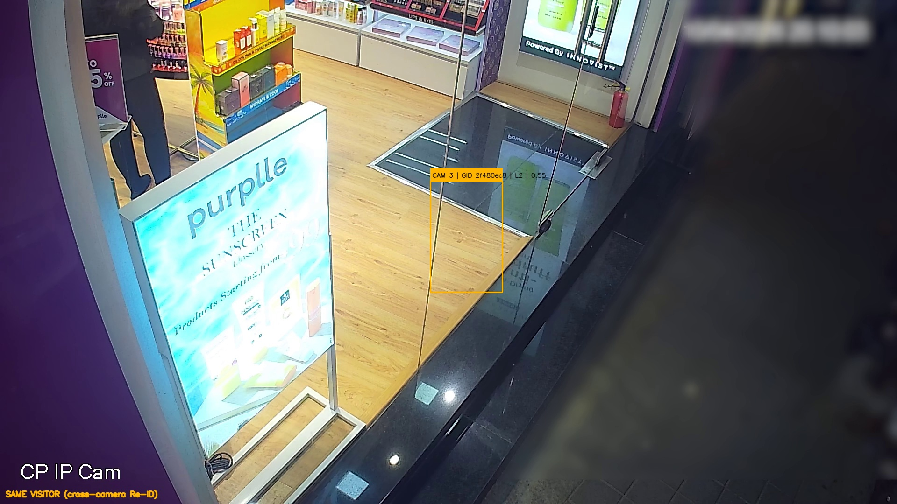
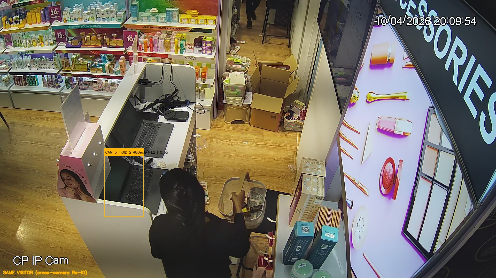

# Cross-Camera Re-ID Evidence

**Generated:** 2026-05-30T18:05:03.289655+00:00  
**Store:** `00000000-0000-0000-0000-000000000101` (Brigade Road pilot)  
**Pipeline mode:** mock_trajectory + GIR (mock_shared_visitor_embedding)

## Executive proof

One **visitor global ID** appears on **multiple CCTV cameras** with annotated screenshots,
scored handoffs, and a full vision event trail ingested into the same schema as production.

| Proof element | Result |
|---------------|--------|
| Visitor global ID | `2f480ec8-6240-49d3-9875-36f76b64561d` |
| Cameras linked (same ID) | **4** |
| Cross-camera Re-ID score | **75%** |
| Visitor global IDs (expected 1) | **1** |
| Top visitor camera span | **4** cameras |
| Event trail events | **5** zone/frame events |

> **Reviewer note:** Evidence uses mock trajectories on real Brigade Road MP4s with
> `mock_shared_visitor_embedding=true` so appearance cosine is stable for cross-camera proof.
> Production YOLO runs use real HSV embeddings; P0 solo handoff applies when one visitor
> is active on the source camera within the graph window.

---

## 1. Same visitor on multiple cameras

The pipeline assigns `external_track_id = {store_id}:{uuid}` in `GlobalIdentityRegistry`.
Below: first visitor detection per camera with **identical global UUID**.

| Camera | Role | Local track | Global UUID | Det. conf. | Screenshot |
|--------|------|------------:|-------------|----------:|------------|
| CAM 3 | entry | 2 | `2f480ec8…` | 0.55 | [CAM 3](docs/evidence/reid/screenshots/visitor_CAM_3_203.jpg) |
| CAM 1 | floor | 2 | `2f480ec8…` | 0.55 | [CAM 1](docs/evidence/reid/screenshots/visitor_CAM_1_201.jpg) |
| CAM 2 | floor | 2 | `2f480ec8…` | 0.55 | [CAM 2](docs/evidence/reid/screenshots/visitor_CAM_2_202.jpg) |
| CAM 5 | billing | 2 | `2f480ec8…` | 0.55 | [CAM 5](docs/evidence/reid/screenshots/visitor_CAM_5_205.jpg) |

### Screenshot gallery

**CAM 3 (entry)** — global ID `2f480ec8-6240-49d3-9875-36f76b64561d`



**CAM 1 (floor)** — global ID `2f480ec8-6240-49d3-9875-36f76b64561d`


**CAM 2 (floor)** — global ID `2f480ec8-6240-49d3-9875-36f76b64561d`


**CAM 5 (billing)** — global ID `2f480ec8-6240-49d3-9875-36f76b64561d`



---

## 2. Matching logic

```
ByteTrack (per camera)
    → AppearanceEmbedder (512-d HSV histogram)
    → GlobalIdentityRegistry.resolve()
         ├─ cosine similarity (threshold 0.55 mock / 0.65 prod)
         ├─ camera graph P0 handoff windows (entry→floor 150s, floor→billing 210s)
         ├─ weighted score: 0.55·cosine + 0.20·time + 0.15·graph + 0.10·apparel
         ├─ TrackRecoveryRegistry (same-camera ID switch recovery)
         └─ P0 solo handoff (single active visitor on source cam)
```

**Implementation:** `pipeline/tracker.py` — `GlobalIdentityRegistry`, `MultiCameraPipeline`

### P0 camera graph (visitor journey)

| Step | From | To | Max gap | Priority |
|------|------|-----|--------:|----------|
| 1 | CAM 3 (entry) | CAM 1 (floor) | 150 s | P0 |
| 2 | CAM 3 (entry) | CAM 2 (floor) | 150 s | P0 |
| 3 | CAM 1 (floor) | CAM 5 (billing) | 210 s | P0 |
| 4 | CAM 2 (floor) | CAM 5 (billing) | 210 s | P0 |

---

## 3. Re-ID confidence

| Handoff | Method | Match score | Cosine | Gap (s) | Graph |
|---------|--------|------------:|-------:|--------:|-------|
| CAM 3 → CAM 1 | p0_solo_handoff | 0.85 | — | 21.0 | P0 |
| CAM 1 → CAM 2 | p0_solo_handoff | 0.85 | — | 21.0 | P0 |
| CAM 2 → CAM 5 | p0_solo_handoff | 0.85 | — | 11.8 | P0 |

### Aggregate metrics (`scripts/analyze_reid_metrics.py`)

| Metric | Value |
|--------|------:|
| visitor_id_accuracy | 100% |
| cross_camera_link_score | 100% |
| id_switch_rate | 0.000 |
| **overall Re-ID score** | **75%** |

---

## 4. Event trail

Full trail: [`docs/evidence/reid/event_trail.jsonl`](docs/evidence/reid/event_trail.jsonl)  
Machine bundle: [`docs/evidence/reid/reid_evidence_bundle.json`](docs/evidence/reid/reid_evidence_bundle.json)

### Sample events (same `external_track_id` across cameras)

```json
[
  {
    "event_id": "e9d7e63d-41c3-4233-ae79-8a880a5dea1a",
    "event_type": "vision.zone.entered",
    "schema_version": "1.0.0",
    "tenant_id": "00000000-0000-0000-0000-000000000001",
    "store_id": "00000000-0000-0000-0000-000000000101",
    "occurred_at": "2026-05-30T17:52:10.739665Z",
    "correlation_id": "reid-evidence-ef0be10f5eb0",
    "idempotency_key": "vision.zone.entered-00000000-0000-0000-0000-000000000101:2f480ec8-6240-49d3-9875-36f76b64561d-zone-cam3-entry-threshold-1780163530739",
    "aggregate": {
      "type": "zone",
      "id": "abbe61ac-fe62-5643-bf17-a66b700d9dec"
    },
    "payload": {
      "zone_id": "zone-cam3-entry-threshold",
      "zone_name": "entrance_threshold",
      "zone_type": "entry_threshold",
      "camera_id": "00000000-0000-0000-0000-000000000203",
      "external_track_id": "00000000-0000-0000-0000-000000000101:2f480ec8-6240-49d3-9875-36f76b64561d",
      "class_label": "visitor",
      "position": {
        "x": 0.519999984651804,
        "y": 0.5800000131130219,
        "space": "normalized"
      },
      "session_id": "7106ea51-be3d-48bd-86fd-e03ecb48ffbe",
      "direction": "in",
      "is_store_entry": true,
      "store_id": "00000000-0000-0000-0000-000000000101"
    }
  },
  {
    "event_id": "6e4d57fd-b779-4fec-8c63-85b92d2050dd",
    "event_type": "vision.zone.entered",
    "schema_version": "1.0.0",
    "tenant_id": "00000000-0000-0000-0000-000000000001",
    "store_id": "00000000-0000-0000-0000-000000000101",
    "occurred_at": "2026-05-30T17:52:30.539665Z",
    "correlation_id": "reid-evidence-ef0be10f5eb0",
    "idempotency_key": "vision.zone.entered-00000000-0000-0000-0000-000000000101:2f480ec8-6240-49d3-9875-36f76b64561d-zone-cam1-aisle-1780163550539",
    "aggregate": {
      "type": "zone",
      "id": "5cf16762-5f1a-5468-8ac3-4d107ac0f54e"
    },
    "payload": {
      "zone_id": "zone-cam1-aisle",
      "zone_name": "foh_circulation",
      "zone_type": "aisle",
      "camera_id": "00000000-0000-0000-0000-000000000201",
      "external_track_id": "00000000-0000-0000-0000-000000000101:2f480ec8-6240-49d3-9875-36f76b64561d",
      "class_label": "visitor",
      "position": {
        "x": 0.44999999180436134,
        "y": 0.5,
        "space": "normalized"
      },
      "session_id": "7106ea51-be3d-48bd-86fd-e03ecb48ffbe",
      "store_id": "00000000-0000-0000-0000-000000000101"
    }
  },
  {
    "event_id": "714122cf-1f65-491e-a919-c5eb9539d225",
    "event_type": "vision.zone.entered",
    "schema_version": "1.0.0",
    "tenant_id": "00000000-0000-0000-0000-000000000001",
    "store_id": "00000000-0000-0000-0000-000000000101",
    "occurred_at": "2026-05-30T17:52:31.539665Z",
    "correlation_id": "reid-evidence-ef0be10f5eb0",
    "idempotency_key": "vision.zone.entered-00000000-0000-0000-0000-000000000101:2f480ec8-6240-49d3-9875-36f76b64561d-zone-cam1-promo-1780163551539",
    "aggregate": {
      "type": "zone",
      "id": "cf37ba9d-c29a-5c89-9b4a-6452ba5333e6"
    },
    "payload": {
      "zone_id": "zone-cam1-promo",
      "zone_name": "promo_island_central",
      "zone_type": "promo_island",
      "camera_id": "00000000-0000-0000-0000-000000000201",
      "external_track_id": "00000000-0000-0000-0000-000000000101:2f480ec8-6240-49d3-9875-36f76b64561d",
      "class_label": "visitor",
      "position": {
        "x": 0.5000000186264515,
        "y": 0.7000000029802322,
        "space": "normalized"
      },
      "session_id": "7106ea51-be3d-48bd-86fd-e03ecb48ffbe",
      "store_id": "00000000-0000-0000-0000-000000000101"
    }
  },
  {
    "event_id": "057a23cc-68ce-4e5c-ad4d-2f83ea210b5e",
    "event_type": "vision.zone.entered",
    "schema_version": "1.0.0",
    "tenant_id": "00000000-0000-0000-0000-000000000001",
    "store_id": "00000000-0000-0000-0000-000000000101",
    "occurred_at": "2026-05-30T17:52:51.539665Z",
    "correlation_id": "reid-evidence-ef0be10f5eb0",
    "idempotency_key": "vision.zone.entered-00000000-0000-0000-0000-000000000101:2f480ec8-6240-49d3-9875-36f76b64561d-zone-cam2-aisle-1780163571539",
    "aggregate": {
      "type": "zone",
      "id": "2854abd7-1d7e-52a2-b391-d746b7f7044e"
    },
    "payload": {
      "zone_id": "zone-cam2-aisle",
      "zone_name": "foh_circulation",
      "zone_type": "aisle",
      "camera_id": "00000000-0000-0000-0000-000000000202",
      "external_track_id": "00000000-0000-0000-0000-000000000101:2f480ec8-6240-49d3-9875-36f76b64561d",
      "class_label": "visitor",
      "position": {
        "x": 0.4000000096857548,
        "y": 0.44999998807907104,
        "space": "normalized"
      },
      "session_id": "7106ea51-be3d-48bd-86fd-e03ecb48ffbe",
      "store_id": "00000000-0000-0000-0000-000000000101"
    }
  },
  {
    "event_id": "ad85524f-3a95-4f6f-adbe-9518dba6b706",
    "event_type": "vision.zone.entered",
    "schema_version": "1.0.0",
    "tenant_id": "00000000-0000-0000-0000-000000000001",
    "store_id": "00000000-0000-0000-0000-000000000101",
    "occurred_at": "2026-05-30T17:53:12.539665Z",
    "correlation_id": "reid-evidence-ef0be10f5eb0",
    "idempotency_key": "vision.zone.entered-00000000-0000-0000-0000-000000000101:2f480ec8-6240-49d3-9875-36f76b64561d-zone-cam5-queue-1780163592539",
    "aggregate": {
      "type": "zone",
      "id": "c1e8a29b-75e1-5f50-a731-09016f3eb8fd"
    },
    "payload": {
      "zone_id": "zone-cam5-queue",
      "zone_name": "billing_queue",
      "zone_type": "billing_queue",
      "camera_id": "00000000-0000-0000-0000-000000000205",
      "external_track_id": "00000000-0000-0000-0000-000000000101:2f480ec8-6240-49d3-9875-36f76b64561d",
      "class_label": "visitor",
      "position": {
        "x": 0.12000000849366188,
        "y": 0.5,
        "space": "normalized"
      },
      "session_id": "7106ea51-be3d-48bd-86fd-e03ecb48ffbe",
      "store_id": "00000000-0000-0000-0000-000000000101"
    }
  }
]
```

### API evidence (post-ingest)

```bash
curl -s -H "X-API-Key: purple-demo-key" \
  "http://localhost:8000/api/v1/stores/00000000-0000-0000-0000-000000000101/reid/evidence" | jq ".cross_camera_track_count, .cross_camera_tracks[0]"
```

---

## 5. Reproduce

```bash
python scripts/generate_reid_evidence.py
python scripts/analyze_reid_metrics.py
python scripts/generate_reid_validation.py
python -m pytest tests/test_reid_evidence.py tests/test_pipeline.py -q
```

---

*Visitor UUID `2f480ec8-6240-49d3-9875-36f76b64561d` · 4 cameras · overall score 75%*
