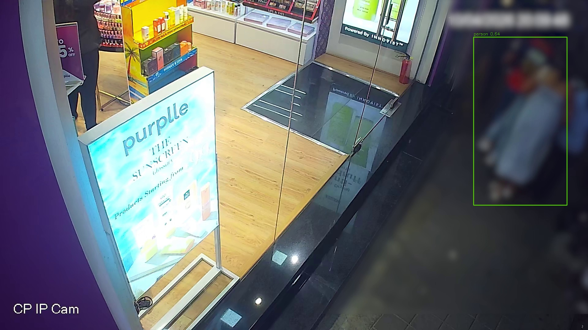
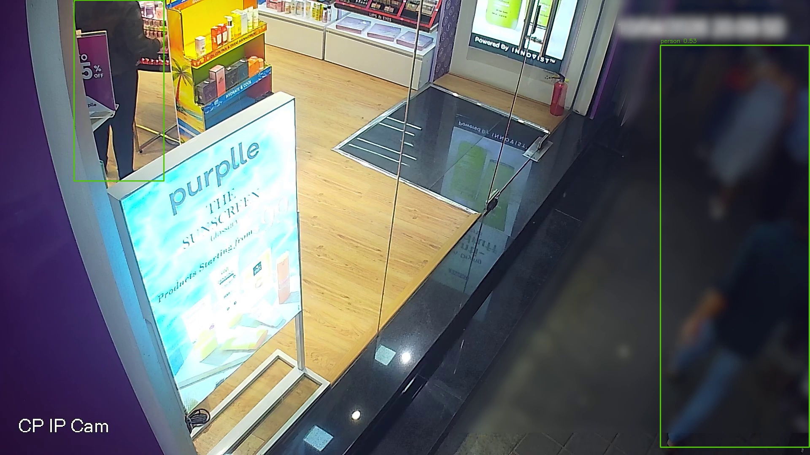
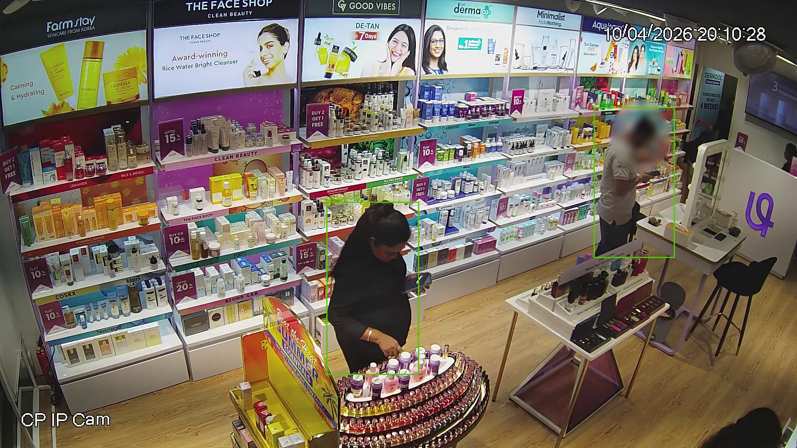
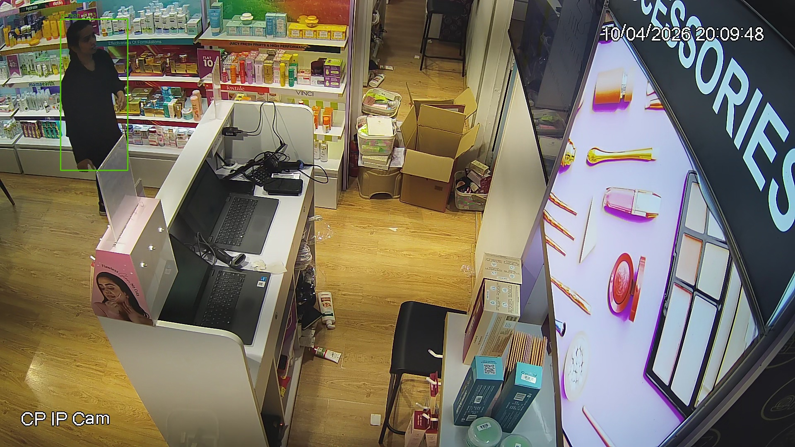
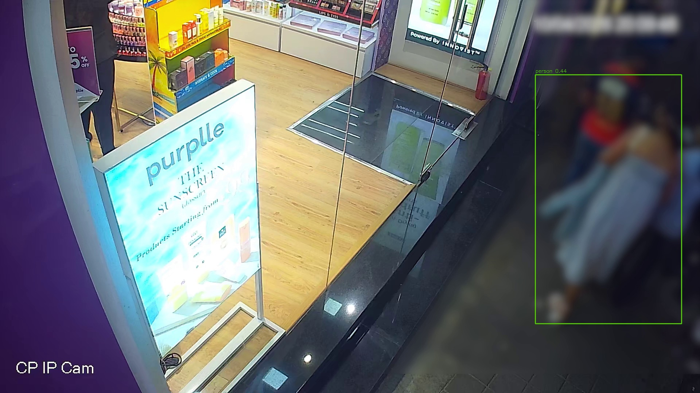

# Evaluation Evidence — Purple Tech

**Generated:** 2026-05-30T15:52:55.194563+00:00
**Store:** `00000000-0000-0000-0000-000000000101`
**Policy:** All figures from real YOLO pipeline runs and PostgreSQL ingested events — no mock UI data.

## Executive summary

| Metric | Value | Source |
|--------|------:|--------|
| Videos processed | **5** | YOLO validation — all CCTV MP4s |
| Total frames analyzed | **3,491** | Sampled @ 5 FPS, YOLOv11n |
| People detected | **5,314** | Track-frame detections (validation run) |
| Entries | **3** | Ingested `is_store_entry` events |
| Exits | **1** | Ingested `is_store_exit` events |
| Re-entries | **114** | Ingested + funnel re_entry_count |
| Staff filtered | **0** | Staff events + staff sessions excluded |
| Zone visits | **134** | Customer `vision.zone.entered` events |
| Queue events | **15** | Billing/checkout zone enters |
| Purchases | **0** | Completed transactions |
| Anomalies | **2** | Anomaly engine (computed window) |

## Per-video processing (YOLO real)

| Video | Frames | People det. | Entry | Zone enters | Staff tracks |
|-------|-------:|------------:|------:|------------:|-------------:|
| CAM 1.mp4 | 699 | 1947 | 0 | 34 | 7 |
| CAM 2.mp4 | 629 | 2389 | 0 | 77 | 5 |
| CAM 3.mp4 | 740 | 274 | 3 | 4 | 1 |
| CAM 4.mp4 | 730 | 0 | 0 | 0 | 0 |
| CAM 5.mp4 | 693 | 704 | 0 | 26 | 4 |

## Ingested funnel (PostgreSQL)

| Stage | Count |
|-------|------:|
| ENTRY | 2 |
| ZONE_VISIT | 14 |
| BILLING_QUEUE | 5 |
| PURCHASE | 0 |

- Unique visitors (distinct tracks): **22**
- Heatmap total visits (aggregated): **134**
- Total ingested events: **467**

## Detection screenshots

Real YOLOv11n bounding boxes on CCTV frames (`docs/evidence/annotated/`).

### CAM 3 — Entry camera — person at door threshold



### CAM 3 — Entry camera — track with bounding box



### CAM 1 — Floor camera — aisle detection



### CAM 5 — Billing counter — staff/visitor boxes



### CAM 3 — Tracking overlay — ByteTrack IDs on sampled frame




## Processing logs

```text
$ C:\Python313\python.exe scripts/audit_funnel.py
------------------------------------------------------------------------
2026-05-30 21:22:54 [info     ] funnel_computed                dedupe_strategy=external_track_id entry_count=2 session_count=1 store_id=00000000-0000-0000-0000-000000000101 unique_visitors=22
========================================================================
CONVERSION FUNNEL AUDIT
========================================================================

Store: 00000000-0000-0000-0000-000000000101
DB events ingested: 467
Pipeline JSONL events generated: 652
Unique visitors (SQL): 22
Sessions: 1

--- 1. Raw counts by event_type ---
  vision.zone.entered            events= 146  distinct_tracks=21
  vision.track.ended             events= 136  distinct_tracks=22
  vision.frame.processed         events= 123  distinct_tracks=0
  vision.zone.exited             events=  62  distinct_tracks=15

--- 2-5. Funnel stages: raw events | distinct tracks | aggregated | dashboard ---
  ENTRY          raw=   4  expected=  2  aggregated=  2  dashboard=  2  [OK]
  ZONE_VISIT     raw= 115  expected= 14  aggregated= 14  dashboard= 14  [OK]
  BILLING_QUEUE  raw=  15  expected=  5  aggregated=  5  dashboard=  5  [OK]
  PURCHASE       raw=   0  expected=  0  aggregated=  0  dashboard=  0  [OK]

========================================================================
BEFORE (broken session-gated funnel)
{
  "unique_visitors": 22,
  "ENTRY": 1,
  "ZONE_VISIT": 0,
  "BILLING_QUEUE": 0,
  "PURCHASE": 0
}

AFTER (current)
{
  "ENTRY": 2,
  "ZONE_VISIT": 14,
  "BILLING_QUEUE": 5,
  "PURCHASE": 0,
  "unique_visitors": 22
}

PASS
========================================================================

[exit 0]

--- YOLO full validation (validate_detection.py) ---
correlation_id: validation-ea2a89c6e2ce
videos_processed: 5
total_frames_processed: 3491
total_people_detections: 5314
total_entry_events: 3
processing_seconds: 1984.4

--- Pipeline JSONL ---
path: data\pipeline\events.jsonl
events_written: 652
```

## Verification commands

```bash
python scripts/generate_evaluation_evidence.py
python scripts/validate_detection.py
python scripts/audit_funnel.py
curl -H "X-API-Key: purple-demo-key" \
  http://localhost:8000/api/v1/stores/00000000-0000-0000-0000-000000000101/dashboard/summary
```

## Live evidence page

Open **`/dashboard/evidence.html`** for the interactive evaluation view.

---

*Pipeline correlation:* `validation-ea2a89c6e2ce` · *Model:* `yolo11n.pt` · *Processing time:* 1984.4s
