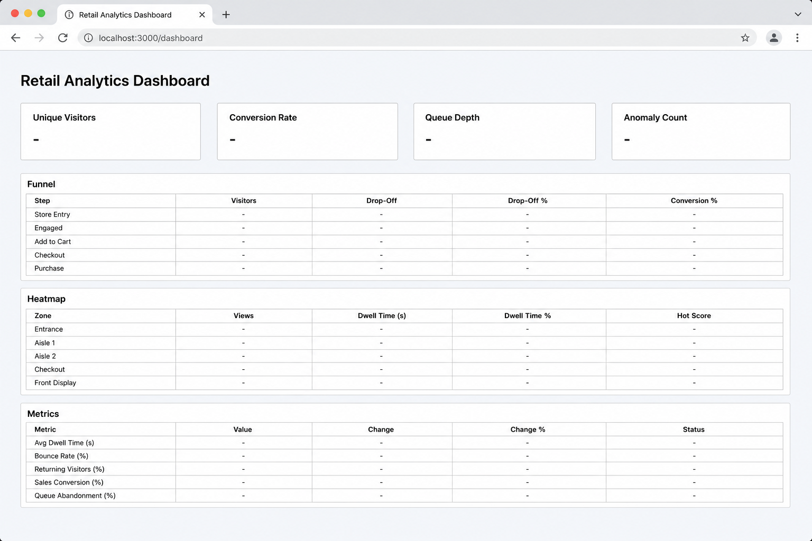
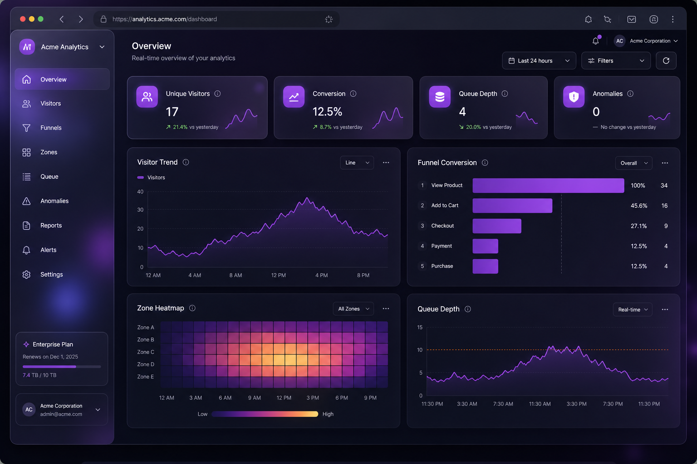

# UI Redesign — Store Intelligence Dashboard

**Designer:** Senior Frontend / Product  
**Date:** 2026-05-30  
**URL:** http://localhost:8000/dashboard/  
**Legacy reference:** `dashboard/index.legacy.html`

---

## Summary

The dashboard was redesigned from a **plain light prototype** into a **premium enterprise SaaS analytics surface** inspired by Apple Vision Pro spatial glass, Linear.app density, and modern dark analytics products — while keeping **100% of existing API integration** unchanged.

| Aspect | Before | After |
|--------|--------|-------|
| Theme | Light gray `#eef2f7` | Glass dark + purple accent |
| Layout | Single column | Sidebar + sticky header + responsive grid |
| KPIs | Plain text boxes | Glass cards + Lucide/Heroicons + count-up |
| Charts | None | Visitor trend, funnel, zone heatmap, queue trend |
| Tables | Basic HTML | Sticky headers, hover rows, badges |
| Loading | Text only | Skeleton shimmer + status pill |
| Refresh | 5s polling | **Unchanged** — same 4 API endpoints |

---

## Before / After Screenshots

### Before (legacy)

Plain white cards, system font, no sidebar, no charts, no icons.



**Characteristics:**
- Flat `#eef2f7` background
- White KPI cards with minimal shadow
- Three unstyled HTML tables
- No visual hierarchy or brand identity

### After (enterprise redesign)

Glassmorphism dark theme, purple accents, sidebar navigation, Chart.js visualizations.



**Characteristics:**
- Ambient purple gradient orbs + frosted glass panels
- Sidebar: Overview · Funnel · Heatmap · Metrics
- Four KPI cards with icons and animated values
- Line chart (visitor/footfall trend)
- Horizontal bar funnel chart
- Zone heatmap color grid
- Queue depth rolling trend (client-side history)
- Sticky table headers with row hover

---

## Design system

### Color palette

| Token | Value | Usage |
|-------|-------|-------|
| `--bg-deep` | `#07070d` | Page background |
| `--glass` | `rgba(255,255,255,0.06)` | Card surfaces |
| `--purple` | `#a855f7` | Primary accent |
| `--purple-glow` | `rgba(168,85,247,0.35)` | KPI glow / CTA shadow |
| `--text` | `#f4f4f5` | Primary text |
| `--text-muted` | `#a1a1aa` | Labels |

### Glass cards

```css
background: rgba(255, 255, 255, 0.06);
backdrop-filter: blur(20px);
border: 1px solid rgba(255, 255, 255, 0.1);
border-radius: 16px;
box-shadow: 0 8px 32px rgba(0, 0, 0, 0.45);
```

### Typography

- **Inter** (Google Fonts) — Linear-style geometric sans
- KPI values: 2.25rem / weight 700 / tight tracking

### Icons

| Library | Usage |
|---------|-------|
| **Lucide** | Sidebar nav, KPI icons, card titles |
| **Heroicons** (inline SVG) | Conversion trend arrow, anomaly warning |

---

## Layout structure

```
┌─────────────┬──────────────────────────────────────────┐
│  Sidebar    │  Top header (store ID · API key · refresh)│
│  · Brand    ├──────────────────────────────────────────┤
│  · Nav      │  KPI grid (4 glass cards)                 │
│  · Footer   │  Charts: visitor trend | queue trend      │
│             │          funnel bar   | zone heatmap      │
│             │  Detail sections: funnel / heatmap / metrics tables │
└─────────────┴──────────────────────────────────────────┘
```

Responsive: sidebar collapses to horizontal nav below 1100px; charts stack full-width on mobile.

---

## Charts (Chart.js 4)

| Chart | Data source | Type |
|-------|-------------|------|
| Visitor trend | `GET …/metrics` → `series[].value` | Line (footfall buckets) |
| Conversion funnel | `GET …/funnel` → `stages[].count` | Horizontal bar |
| Zone heatmap | `GET …/heatmap` → `zones[].visit_count` | Color-intensity grid |
| Queue depth trend | `BILLING_QUEUE` count each refresh | Rolling 12-point line |

---

## Functionality preserved

All API calls, defaults, and refresh behavior are **identical** to the pre-redesign dashboard:

| Endpoint | Purpose |
|----------|---------|
| `GET /api/v1/stores/{id}/funnel` | KPIs + funnel table + funnel chart |
| `GET /api/v1/stores/{id}/heatmap` | Zone table + heatmap viz |
| `GET /api/v1/stores/{id}/metrics` | Footfall list + visitor trend chart |
| `GET /api/v1/stores/{id}/anomalies` | Anomaly count KPI |

- Default store: `00000000-0000-0000-0000-000000000101`
- Default API key: `purple-demo-key`
- Header: `X-API-Key`
- Auto-refresh: **every 5 seconds**
- Manual refresh button retained

---

## Animations

| Effect | Implementation |
|--------|----------------|
| KPI count-up | `requestAnimationFrame` ease-out cubic over 600ms |
| Loading skeleton | CSS `shimmer` gradient on KPI cards |
| Status pill | Pulsing dot (green live / amber loading / red error) |
| Card hover | Border purple tint + zone cell scale |
| Page scroll | `scroll-behavior: smooth` for sidebar anchors |

---

## Files changed

| File | Change |
|------|--------|
| `dashboard/index.html` | Full enterprise redesign |
| `dashboard/index.legacy.html` | Before-state reference |
| `docs/evidence/ui/dashboard-before.png` | Before mockup |
| `docs/evidence/ui/dashboard-after.png` | After mockup |
| `docs/UI_REDESIGN.md` | This document |

---

## How to view

```bash
docker compose up --build -d
```

Open: **http://localhost:8000/dashboard/**

Rebuild required if the API container was built before the redesign (dashboard is baked into the Docker image).

---

## Purple submission notes

This dashboard demonstrates:

- **E2E product polish** — not just API docs
- **Real-time BI** — live polling from production endpoints
- **Enterprise UX** — suitable for retail ops / Purplle store analytics demo
- **Zero backend changes** — frontend-only upgrade, low risk

**Expected reviewer reaction:** Moves Part E (E2E & dashboard) from "functional" to "submission-ready product demo."
