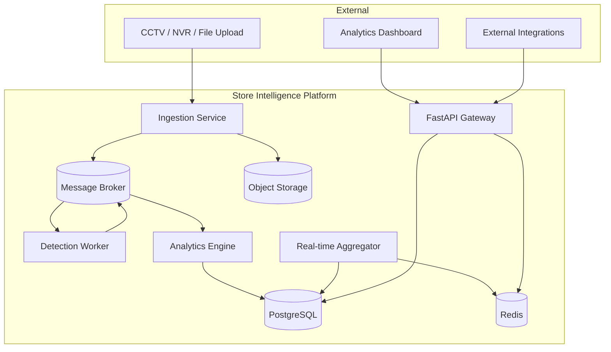

# Store Intelligence System — Architecture

> **Status:** Core API + BI + offline pipeline **implemented**; Redis/MinIO/worker topology **planned**  
> **Scope:** CCTV → retail analytics platform with YOLO + ByteTrack pipeline in `pipeline/`  
> **Start here for running code:** [README.md](../../README.md) and [DESIGN.md](../../DESIGN.md)

## Implemented vs planned

| Area | Status | Location |
|------|--------|----------|
| FastAPI REST (ingest, funnel, heatmap, anomalies, metrics, health) | ✅ Implemented | `app/` |
| PostgreSQL schema + Alembic migrations | ✅ Implemented | `alembic/`, `app/models/` |
| On-read analytics (funnel, heatmap, anomalies) | ✅ Implemented | `app/domain/`, `app/services/` |
| Structured logging + trace IDs | ✅ Implemented | `app/observability/`, `app/middleware/` |
| Docker Compose (API + Postgres) | ✅ Implemented | `docker-compose.yml` |
| Offline detection pipeline (mock + YOLO) | ✅ Implemented | `pipeline/` |
| Staff exclusion in BI | ✅ Implemented | `app/domain/vision/filters.py` |
| Redis Streams, MinIO, WebSocket | 📋 Planned | See roadmap docs |
| Analytics projector → `store_metrics` | 📋 Planned | Metrics endpoint uses rollups when present |
| Auth (JWT / API keys) | 📋 Planned | OpenAPI documents future auth |

Documents below mix **target architecture** (full worker topology) with **MVP decisions**. When a section describes Redis, MinIO, or CRUD endpoints not present in code, treat it as roadmap unless marked implemented above.

## Document Index

| Document | Contents |
|----------|----------|
| [Repository Structure](./repository-structure.md) | Folder layout, module boundaries |
| [Database Schema](./database-schema.md) | ER diagram, tables, indexes |
| [Database Indexing](./database-indexing.md) | Index rationale for core tables |
| [Event Schema](./events.md) | Domain events, envelopes, lifecycle |
| [API Contracts](./api-contracts.md) | REST + WebSocket specifications |
| [Service Architecture](./services.md) | Services, deployment topology |
| [Data Flow](./data-flow.md) | End-to-end pipelines |
| [Logging Strategy](./logging-strategy.md) | Structured logging, correlation |
| [Testing Strategy](./testing-strategy.md) | Unit → E2E pyramid |
| [Design Decisions](./design-decisions.md) | ADR-style rationale and tradeoffs |
| [Implementation Roadmap](./implementation-roadmap.md) | Phased delivery plan |

## System Context (target topology)

**Today:** CCTV → `pipeline/` (host) → HTTP ingest → PostgreSQL → on-read BI via API. No broker or object storage in the default Compose stack.

## Architectural Principles

1. **Hexagonal / ports-and-adapters** — Domain logic depends on interfaces, not YOLO, PostgreSQL, or broker specifics.
2. **Event-driven decoupling** — Ingestion, detection, and analytics communicate via versioned domain events.
3. **Schema-agnostic ingestion** — Cameras, zones, and metadata are configuration-driven, not baked into code.
4. **Fail-safe defaults** — Unknown labels, missing calibration, and partial frames degrade gracefully with explicit audit trails.
5. **Observable by design** — Every async hop carries correlation IDs; metrics align to business KPIs.
6. **Deploy as containers** — Docker Compose for dev/staging; same images promote to orchestrated production.

## Technology Stack

| Layer | Choice | Rationale |
|-------|--------|-----------|
| API | FastAPI | Async-native, OpenAPI, WebSocket support |
| Database | PostgreSQL 16+ | ACID analytics, JSONB for flexible metadata |
| Cache / RT | Redis 7 (planned) | Pub/sub, streams, session cache |
| Broker | Redis Streams (planned) | Low ops overhead; upgrade path when scale demands |
| Object storage | MinIO / S3 (planned) | Frame clips, model artifacts |
| CV pipeline | YOLO + ByteTrack | Implemented in `pipeline/`; mock mode for dev |

## Bounded Contexts

| Context | Responsibility |
|---------|----------------|
| **Tenant & Store** | Multi-tenant hierarchy, store config, operating hours |
| **Media Ingestion** | Frame/video acquisition, normalization, storage refs |
| **Vision Pipeline** | Detection, tracking, zone intersection |
| **Event Fabric** | Publish, route, persist, replay domain events |
| **Analytics** | Aggregations, KPIs, dwell time, footfall, heatmaps |
| **API & Real-time** | REST queries, WebSocket push, export jobs |

## Non-Goals (remaining)

- Training custom YOLO weights on production data
- Production Kubernetes manifests (Compose-first; K8s notes in roadmap)
- Frontend dashboard implementation
