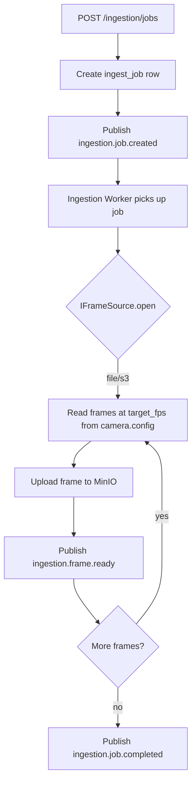
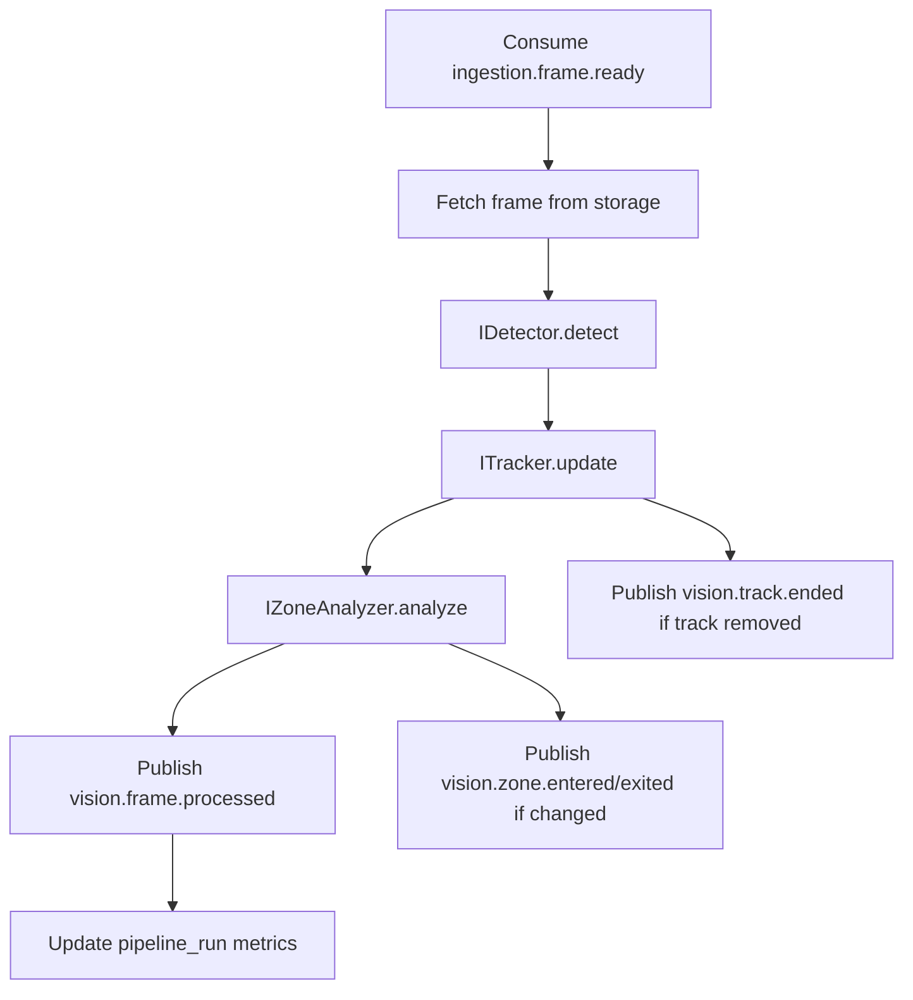
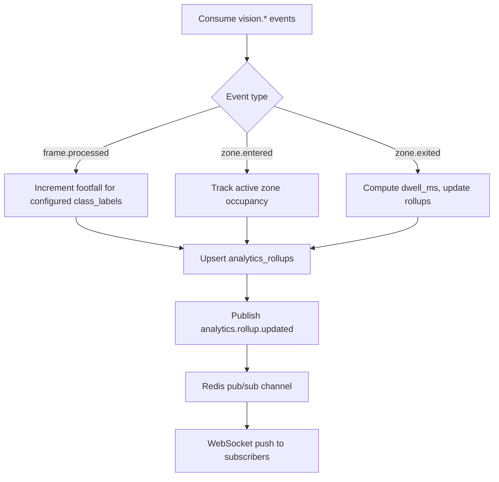

# Data Flow

## End-to-End Pipeline Overview

```
┌──────────────┐    ┌──────────────┐    ┌──────────────┐    ┌──────────────┐    ┌──────────────┐
│   Sources    │───►│  Ingestion   │───►│  Detection   │───►│  Analytics   │───►│  Delivery    │
│ RTSP/File/S3 │    │   Worker     │    │   Worker     │    │   Worker     │    │  API / WS    │
└──────────────┘    └──────────────┘    └──────────────┘    └──────────────┘    └──────────────┘
                           │                   │                   │
                           ▼                   ▼                   ▼
                    ┌──────────────┐    ┌──────────────┐    ┌──────────────┐
                    │ Object Store │    │ Redis Streams│    │  PostgreSQL  │
                    │   (MinIO)    │    │  Event Bus   │    │  + Rollups   │
                    └──────────────┘    └──────────────┘    └──────────────┘
```

## Flow 1: Configuration Bootstrap (No Video)

```
Admin → API → PostgreSQL
  1. Create tenant / store
  2. Register cameras (source_type, URI — may be placeholder until dataset arrives)
  3. Define zones (normalized polygons — no assumption on resolution)
  4. Map class_labels (external_id → display_name) when model taxonomy is known
```

**Key:** Configuration is fully operable before any CV code exists.

## Flow 2: Batch Video Ingestion (Dataset Arrival)



**Data artifacts:**
- `media_assets` — one row per source file (optional)
- `ingest_jobs` — job lifecycle
- Object storage — `{tenant}/{store}/{camera}/{job_id}/frame_{index}.jpg`
- Redis Stream — frame events

## Flow 3: Detection (Pluggable)



**Stub mode:** `StubDetector` returns synthetic detections (configurable count) for integration testing without GPU.

**Production mode:** `YoloDetector` + `ByteTrackAdapter` — same event output shape.

## Flow 4: Analytics Aggregation



### Metric Definitions (Configuration-Driven)

| Metric | Source Events | Dimensions | Notes |
|--------|---------------|------------|-------|
| `footfall.count` | `vision.frame.processed` | store, camera, class_label, time bucket | Only classes with `metadata.count_in_footfall=true` |
| `zone.occupancy.current` | zone enter/exit | store, zone | Materialized counter |
| `zone.dwell.p50` | zone exit | store, zone, time bucket | Requires exit event |
| `heatmap.grid` | track positions | camera, grid cell | Optional sampling |

## Flow 5: Query Path (Historical)

```
Client → GET /analytics/footfall → API → AnalyticsService
  → Read analytics_rollups (pre-aggregated)
  → If drill-down needed: query detections/tracks with time bounds (slow path)
  → Return series JSON
```

**Tradeoff:** Dashboard reads never scan raw detections table by default.

## Flow 6: Real-time Path

```
analytics.rollup.updated → RealtimeService
  → PUBLISH si:rt:{store_id}
  → API WebSocket handler SUBSCRIBE
  → Filter by client subscription
  → Push JSON message
```

Latency budget: **< 2 seconds** from frame processed to WebSocket client (p95, stub pipeline).

## Flow 7: Event Persistence (Audit / Replay)

```
All streams → Event Projector worker
  → Deserialize envelope
  → INSERT domain_events (idempotent on idempotency_key)
  → Optional: trigger materialized view refresh
```

Replay tooling: `scripts/replay_events.py` reads `domain_events` ordered by `occurred_at`, republishes to streams (dev/staging only).

## Data Retention Flow

| Data Type | Hot (fast query) | Warm | Cold / Archive |
|-----------|------------------|------|----------------|
| Raw frames (MinIO) | 7 days | 30 days | Glacier / delete |
| detections rows | 30 days | 90 days | Aggregate then purge |
| analytics_rollups | 2 years | — | — |
| domain_events | 90 days | 1 year | S3 export |

Retention enforced by scheduled `cleanup_worker` (future) — config per tenant.

## Correlation Propagation

```
HTTP X-Correlation-ID
  → ingest_job.correlation_id (stored)
  → every event envelope.correlation_id
  → structlog context vars
  → PostgreSQL domain_events.correlation_id
  → WebSocket messages include correlation_id (debug builds)
```

Enables single-trace debugging across async hops.

## Failure Flows

| Failure Point | Behavior |
|---------------|----------|
| Frame read error | Retry 3×, skip frame, log warning, continue job |
| Detector OOM | Worker restart, message redelivered, idempotency prevents dup writes |
| DB unavailable | Worker backoff, API returns 503 on readiness |
| Unknown class_label | Map to `unknown` bucket, emit `pipeline.warning` event |
| Zone polygon invalid | Reject at API validation; never reaches pipeline |
