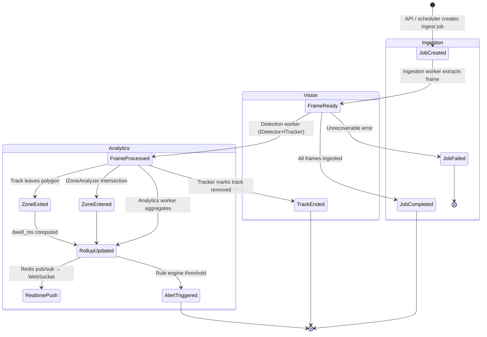
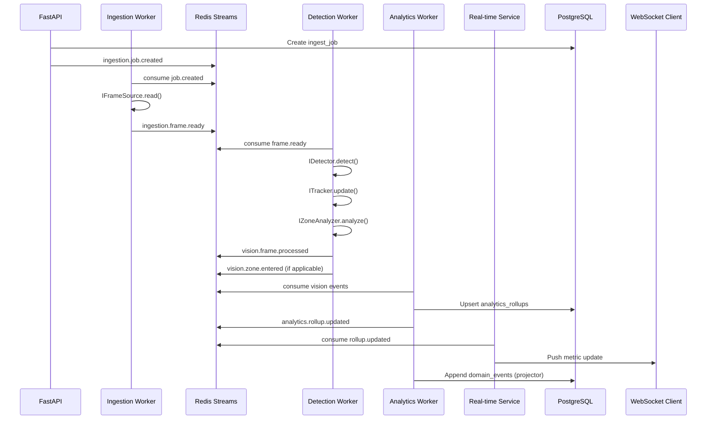

# Event Schema & Lifecycle

## Event-Driven Architecture Overview

All cross-service communication uses **versioned domain events** published to Redis Streams (Phase 1). Services never call each other synchronously for pipeline steps.

### Event Envelope (Universal Wrapper)

Every message on the bus uses this envelope:

```json
{
  "event_id": "550e8400-e29b-41d4-a716-446655440000",
  "event_type": "vision.track.updated",
  "schema_version": "1.0.0",
  "occurred_at": "2026-05-30T12:00:00.000Z",
  "tenant_id": "tenant-uuid",
  "correlation_id": "corr-uuid",
  "causation_id": "parent-event-uuid",
  "idempotency_key": "ingest-job-123-frame-0042",
  "aggregate": {
    "type": "track",
    "id": "track-uuid"
  },
  "payload": { }
}
```

| Field | Required | Purpose |
|-------|----------|---------|
| `event_id` | Yes | Unique event identifier (UUID v4) |
| `event_type` | Yes | Namespaced string: `{context}.{entity}.{action}` |
| `schema_version` | Yes | Semver for payload shape |
| `occurred_at` | Yes | Business timestamp (UTC) |
| `tenant_id` | Yes | Tenant isolation |
| `correlation_id` | Yes | End-to-end trace across services |
| `causation_id` | No | Parent event that caused this one |
| `idempotency_key` | Conditional | Required for ingestion/vision events |
| `aggregate` | Yes | DDD aggregate reference |
| `payload` | Yes | Event-specific body |

## Stream Topology

| Stream Name | Producers | Consumers | Retention |
|-------------|-----------|-----------|-----------|
| `si:ingestion` | Ingestion Worker, API | Detection Worker | 7 days |
| `si:vision` | Detection Worker | Analytics Worker, Event Store Projector | 7 days |
| `si:analytics` | Analytics Worker | Real-time Service, Event Store Projector | 3 days |
| `si:dlq` | All (on failure) | Ops replay tooling | 30 days |

Consumer groups:
- `detection-workers`
- `analytics-workers`
- `event-projector`
- `realtime-push`

## Domain Event Catalog

### Ingestion Context

#### `ingestion.job.created` (v1.0.0)

```json
{
  "ingest_job_id": "uuid",
  "camera_id": "uuid",
  "source": {
    "type": "file|rtsp|s3",
    "uri": "s3://bucket/key or rtsp://...",
    "media_asset_id": "uuid|null"
  },
  "frame_range": { "start": 0, "end": null },
  "pipeline_profile": "default"
}
```

#### `ingestion.frame.ready` (v1.0.0)

Emitted per frame (or batched — see tradeoff below).

```json
{
  "ingest_job_id": "uuid",
  "camera_id": "uuid",
  "frame_index": 42,
  "frame_timestamp": "2026-05-30T12:00:01.500Z",
  "storage_ref": {
    "bucket": "media",
    "key": "tenants/.../frame_0042.jpg"
  },
  "metadata": {
    "width": 1920,
    "height": 1080,
    "content_hash": "sha256:..."
  }
}
```

#### `ingestion.job.completed` / `ingestion.job.failed`

Terminal states with `frame_count`, `duration_ms`, optional `error`.

---

### Vision Context (Pluggable Pipeline Output)

These events are what **`IDetector`** + **`ITracker`** + **`IZoneAnalyzer`** produce — regardless of YOLO/ByteTrack internals.

#### `vision.frame.processed` (v1.0.0)

```json
{
  "pipeline_run_id": "uuid",
  "camera_id": "uuid",
  "frame_index": 42,
  "frame_timestamp": "2026-05-30T12:00:01.500Z",
  "detections": [
    {
      "detection_id": "uuid",
      "class_label_id": "uuid",
      "class_external_id": "person",
      "bbox": { "x": 0.1, "y": 0.2, "w": 0.05, "h": 0.15, "space": "normalized" },
      "confidence": 0.92
    }
  ],
  "tracks": [
    {
      "track_id": "uuid",
      "track_id_ext": 17,
      "detection_id": "uuid",
      "state": "active|lost|removed"
    }
  ],
  "processing_ms": 45
}
```

#### `vision.zone.entered` / `vision.zone.exited` (v1.0.0)

```json
{
  "track_id": "uuid",
  "zone_id": "uuid",
  "camera_id": "uuid",
  "timestamp": "2026-05-30T12:00:02.000Z",
  "position": { "x": 0.5, "y": 0.5, "space": "normalized" }
}
```

#### `vision.track.ended` (v1.0.0)

```json
{
  "track_id": "uuid",
  "camera_id": "uuid",
  "first_seen": "...",
  "last_seen": "...",
  "total_detections": 120
}
```

---

### Analytics Context

#### `analytics.rollup.updated` (v1.0.0)

```json
{
  "store_id": "uuid",
  "camera_id": "uuid|null",
  "metric_name": "footfall.count|zone.dwell.p50|heatmap.grid",
  "bucket_start": "2026-05-30T12:00:00.000Z",
  "bucket_end": "2026-05-30T12:05:00.000Z",
  "dimensions": { "zone_id": "uuid", "class_label": "person" },
  "value": 47,
  "sample_count": 47
}
```

#### `analytics.alert.triggered` (v1.0.0)

For threshold-based rules (occupancy, dwell anomaly).

```json
{
  "rule_id": "uuid",
  "store_id": "uuid",
  "severity": "info|warning|critical",
  "message": "Zone 'checkout' occupancy exceeded threshold",
  "context": { }
}
```

## Event Lifecycle Diagram



## Sequence: Single Frame Happy Path



## Versioning & Compatibility Rules

1. **Additive changes only** in minor versions (new optional payload fields).
2. **Breaking changes** increment major version; consumers register handlers for both during migration window.
3. **`schema_version`** in envelope; deserializer rejects unknown major versions → DLQ.
4. Event types are **never renamed**; deprecate by stopping emission and documenting sunset date.

## Idempotency

| Event Type | Idempotency Key Pattern |
|------------|-------------------------|
| `ingestion.frame.ready` | `{ingest_job_id}:frame:{frame_index}` |
| `vision.frame.processed` | `{pipeline_run_id}:frame:{frame_index}` |
| `analytics.rollup.updated` | `{store_id}:{metric}:{bucket_start}:{hash(dimensions)}` |

Projector and analytics handlers check idempotency before write.

## Batching Tradeoff

| Approach | Pros | Cons |
|----------|------|------|
| Per-frame events | Simple replay, fine-grained tracing | High stream volume at scale |
| Batched `vision.frames.processed` (N frames) | Lower overhead | Harder partial replay |

**Decision:** Start per-frame; introduce batch envelope at `schema_version` 1.1.0 when profiling shows broker pressure.
