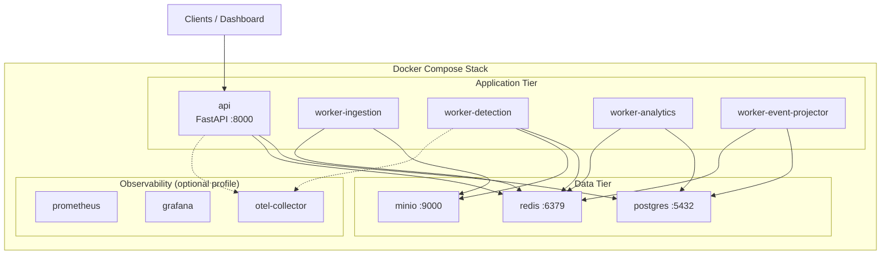
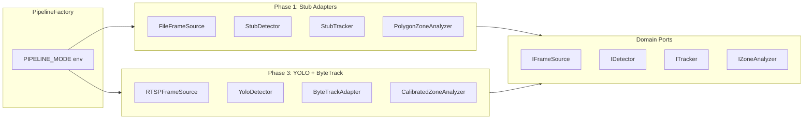

# Service Architecture

## Deployment Topology (Docker Compose)



## Service Catalog

| Service | Container | Responsibility | Scaling Axis |
|---------|-----------|----------------|--------------|
| **API** | `api` | HTTP/WS gateway, auth, CRUD, query analytics | Horizontal (stateless) |
| **Ingestion Worker** | `worker-ingestion` | Read frames via `IFrameSource`, store to object storage, emit ingestion events | Per active camera stream |
| **Detection Worker** | `worker-detection` | Run pluggable pipeline, emit vision events | GPU-bound; scale on queue lag |
| **Analytics Worker** | `worker-analytics` | Aggregate metrics, zone dwell, heatmaps | Horizontal on `si:vision` lag |
| **Event Projector** | `worker-event-projector` | Persist all events to `domain_events` table | Single leader or idempotent horizontal |
| **Real-time Push** | Embedded in API or sidecar | Redis pub/sub → WebSocket fanout | Co-located with API initially |

## Docker Compose Services Definition (Conceptual)

```yaml
# docker/docker-compose.yml (design reference — not implemented yet)
services:
  postgres:      # PostgreSQL 16, volume postgres_data
  redis:         # Redis 7, AOF persistence
  minio:         # S3-compatible, bucket auto-init
  api:           # Depends on postgres, redis, minio; exposes 8000
  worker-ingestion:
  worker-detection:
    # deploy.resources.reservations.devices for GPU when PIPELINE_MODE=yolo_bytetrack
  worker-analytics:
  worker-event-projector:
```

**Profiles:**
- `default` — api, postgres, redis, minio, all workers
- `dev` — adds hot reload volume mounts, debugpy port
- `observability` — prometheus, grafana, otel-collector
- `minimal` — api + postgres + redis (stub pipeline in-process for local dev)

## Internal Service Communication

| From | To | Mechanism | Sync/Async |
|------|-----|-----------|------------|
| API | PostgreSQL | SQLAlchemy async | Sync request scope |
| API | Redis | Cache, pub/sub, rate limit | Sync |
| API | Message Bus | Publish ingestion.job.created | Async |
| Ingestion Worker | Object Storage | S3 API | Sync per frame |
| Ingestion Worker | Bus | Publish frame events | Async |
| Detection Worker | Bus | Consume/produce | Async |
| Detection Worker | Object Storage | Read frames | Sync |
| Analytics Worker | PostgreSQL | Upsert rollups | Async batch |
| Analytics Worker | Redis | Pub realtime updates | Async |
| Event Projector | PostgreSQL | Insert domain_events | Async |

**No direct HTTP calls between workers.**

## Detection Pipeline Plug-in Architecture



### Port Contracts (Interface Signatures — Design Only)

```
IFrameSource:
  open(config) -> None
  read_next() -> Frame | None
  close() -> None

  Frame = {
    index: int,
    timestamp: datetime,
    bytes | storage_ref: ...,
    width: int, height: int
  }

IDetector:
  load(model_config) -> None
  detect(frame: Frame) -> list[RawDetection]
  health() -> HealthStatus

ITracker:
  update(detections: list[RawDetection], frame_meta) -> list[TrackUpdate]

IZoneAnalyzer:
  configure(zones: list[Zone])
  analyze(tracks: list[TrackUpdate], frame_meta) -> list[ZoneEvent]
```

Detection worker orchestrates: `frame → detect → track → zone analyze → emit events`. It does **not** know YOLO exists.

## Application Services (Logical)

| Service Class | Layer | Dependencies (via ports) |
|---------------|-------|--------------------------|
| `IngestionService` | Application | `IFrameSource`, `IEventPublisher`, `IMediaStore`, `IIngestJobRepository` |
| `DetectionOrchestrator` | Application | `IDetector`, `ITracker`, `IZoneAnalyzer`, `IEventPublisher` |
| `AnalyticsService` | Application | `IAnalyticsRepository`, `IEventPublisher`, `IClassLabelRepository` |
| `RealtimeService` | Application | Redis pub/sub adapter |
| `StoreConfigService` | Application | Store/Camera/Zone repositories |

## Security Architecture

| Concern | Approach |
|---------|----------|
| Authentication | JWT (human users) + API keys (integrations) |
| Authorization | RBAC: `admin`, `analyst`, `operator`, `read_only` scoped to tenant |
| Tenant isolation | Row-level `tenant_id` filter in all repositories |
| Secrets | Docker secrets / env injection; never in images |
| Media access | Pre-signed URLs with short TTL |
| Network | Internal compose network; only API + MinIO console exposed |

## Resilience Patterns

| Pattern | Application |
|---------|-------------|
| **Consumer groups** | At-least-once delivery with idempotent handlers |
| **DLQ** | Failed events after 3 retries → `si:dlq` with original payload |
| **Circuit breaker** | RTSP source failures mark camera `status=error`, backoff reconnect |
| **Graceful shutdown** | Workers finish in-flight frame, checkpoint stream offset |
| **Health probes** | API `/health/ready`; workers expose `:8081/health` sidecar HTTP |

## Resource Planning (Initial)

| Service | CPU | Memory | GPU | Notes |
|---------|-----|--------|-----|-------|
| API | 0.5 | 512MB | — | |
| worker-detection (stub) | 0.5 | 512MB | — | |
| worker-detection (YOLO) | 2 | 4GB | 1× | Model dependent |
| worker-ingestion | 1 | 1GB | — | Per stream |
| postgres | 2 | 4GB | — | Scale with retention |
| redis | 0.5 | 1GB | — | Stream memory |

## Production Evolution Path

1. **Compose** — single-host dev/staging
2. **Compose + external managed DB** — RDS/Cloud SQL for PostgreSQL
3. **Kubernetes** — GPU node pool for detection workers; Helm chart (future ADR)
4. **Kafka** — replace Redis Streams when >50k events/sec sustained
