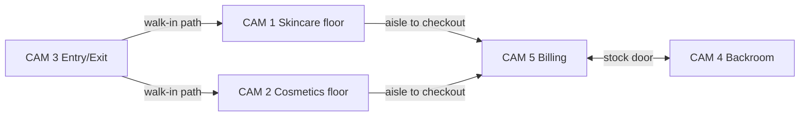

# CCTV Camera Analysis — Purplle Retail Pilot Store

Analysis of the five-camera dataset supplied with the project. Videos were processed from:

`C:\Users\DELL\Downloads\CCTV Footage-20260529T160731Z-3-00144614ea\CCTV Footage`

All clips are **1920×1080**, recorded **2026-04-10 ~20:10–20:12** (evening, low–moderate footfall). Duration **~2.1–2.5 minutes** each (~3,500–4,400 frames). Camera label on-screen: **CP IP Cam**.

Automated metrics used OpenCV frame differencing (regional motion), HOG person detection (sampled every 1 s), and HSV histogram similarity for overlap hints. Visual review of representative frames at 5%, 25%, 50%, 75%, and 95% clip progress confirms layout and purpose.

---

## Store layout summary

Single-floor **Purplle** beauty/cosmetics store:

| Zone (logical) | Camera(s) | Brands / landmarks visible |
|----------------|-----------|----------------------------|
| Main entrance | CAM 3 | Glass doors, Purplle sunscreen promo, threshold strip |
| Skincare aisle | CAM 1 | Farmstay, The Face Shop, Good Vibes, The Derma Co, Minimalist, Aqualogica |
| Cosmetics aisle | CAM 2 | Maybelline, Faces Canada, Lakmé, Swiss Beauty, L'Oreal, Alps Goodness |
| Primary checkout | CAM 5 | White L-shaped counter, dual laptops, barcode scanner, Mamaearth shelf edge |
| Backroom / stock | CAM 4 | Metal shelving, cartons, water jugs, doorway to sales floor |

---

## Camera purpose classification

| Camera | Primary role | Secondary role | Confidence |
|--------|--------------|----------------|------------|
| **CAM 1** | **Main floor** — skincare & derma aisle | Consultation / mini service desk (Purplle vanity, not POS) | High |
| **CAM 2** | **Main floor** — colour cosmetics aisle | Makeup consultation desk (left) | High |
| **CAM 3** | **Entry / exit** — storefront threshold | Interior glimpse of first aisle (upper-left) | High |
| **CAM 4** | Staff / backroom (not customer-facing) | Supports staff movement & stock anomalies | High |
| **CAM 5** | **Billing area** — primary POS & queue | Partial main-floor aisle + backroom mouth | High |

CAM 4 is not one of the three customer analytics roles but is **essential for staff classification** and **CAM 5 ↔ backroom handoff**.

---

## Per-camera analysis

### CAM 1 — Main floor (skincare aisle)

| Attribute | Finding |
|-----------|---------|
| **Resolution / FPS** | 1920×1080 @ ~30 fps, 139.9 s, 171.9 MB |
| **Traffic level** | **Low** — HOG mean 0.12 persons/frame, max 1; ~12% of sampled seconds with ≥1 person |
| **Motion profile** | Highest motion in **bottom third** (0.41) and **right edge** (0.30) — customers walk along aisle length toward consultation desk |
| **Entry line (proposed)** | Horizontal line at **y ≈ 0.88–0.92** where foreground walkway meets shelf zone (customers entering aisle from store circulation) |
| **Exit line (proposed)** | Same line, direction-aware; secondary line at **x ≈ 0.05** (left aisle mouth) for traffic leaving toward entrance / adjacent aisle |
| **Queue regions** | **None at POS.** Optional **consultation wait** polygon around white vanity + stool (**x 0.72–0.95, y 0.55–0.85**) |
| **Staff patterns** | Staff in **black/grey** near consultation desk and behind counter edge; long dwell behind desk; restocking at wall shelves during low traffic |
| **Overlap** | **CAM 5** — bottom-left quadrant histogram corr **0.72** (shared floor / Mamaearth-adjacent circulation). **CAM 2** — same store, different aisle (weak full-frame corr 0.54) |

**Browse zones to calibrate:** six wall bays (one polygon per brand header), central “Beat the Heat” promo island, perfume table (lower right).

---

### CAM 2 — Main floor (cosmetics aisle)

| Attribute | Finding |
|-----------|---------|
| **Resolution / FPS** | 1920×1080 @ ~30 fps, 125.9 s, 154.7 MB |
| **Traffic level** | **Low–medium** — HOG mean 0.21, max 1–2; ~21% seconds with ≥1 person; **highest shopper density** among floor cameras in this clip |
| **Motion profile** | Dominant **left edge** (0.24) and **bottom** (0.22) — flow from left service desk / aisle mouth along brand wall |
| **Entry line (proposed)** | Vertical line at **x ≈ 0.08–0.12** (dark doorway / circulation on far left) |
| **Exit line (proposed)** | Same line outbound; bottom edge **y ≈ 0.90** for customers leaving toward checkout direction |
| **Queue regions** | **Service queue** at makeup consultation desk (**x 0.08–0.28, y 0.45–0.75**). No billing queue in FOV |
| **Staff patterns** | **All-black uniform** staff at consultation desk and assisting at Lakmé / Swiss Beauty; repeated desk ↔ shelf shuttles |
| **Overlap** | **CAM 3** — bottom-right quadrant corr **0.51** (path from entrance toward cosmetics). **CAM 1** — adjacent aisles, no shared FOV |

**Browse zones:** Maybelline, Faces Canada, Lakmé, Swiss Beauty, Mars, Alps, L'Oreal wall segments; “Summer Essentials” floor island.

---

### CAM 3 — Entry / exit

| Attribute | Finding |
|-----------|---------|
| **Resolution / FPS** | 1920×1080 @ ~30 fps, 148.0 s, 182.0 MB |
| **Traffic level** | **Very low** — HOG mean 0.02; only ~2% seconds with detections (few crossings in clip; occluded right third) |
| **Motion profile** | **Right edge** (0.07) and **bottom** (0.05) — door swing and threshold crossings |
| **Entry line (proposed)** | **Primary:** segment across glass threshold, approx **(0.42, 0.33) → (0.68, 0.48)** in normalized coords — exterior (dark floor) → interior (wood laminate) |
| **Exit line (proposed)** | Same segment, reverse direction; classify `entry` vs `exit` by centroid motion normal to line |
| **Queue regions** | None in FOV |
| **Staff patterns** | Greeter / security possible near door; not observed in sample clip |
| **Overlap** | Interior upper-left shows same yellow display and shelving visible after entry — handoff to **CAM 1** or **CAM 2** within ~3–5 m. **CAM 2** BR quadrant corr 0.51 |

**Caveats:** Large **occlusion** on right ~25% of frame (mount / facade). Avoid placing zones in **x > 0.78**.

---

### CAM 4 — Backroom / staff area

| Attribute | Finding |
|-----------|---------|
| **Resolution / FPS** | 1920×1080 @ ~25 fps, 146.0 s, 69.9 MB |
| **Traffic level** | **Very low (staff-only)** — HOG mean 0.05; brief appearances at doorway |
| **Motion profile** | **Bottom** (0.19) and **left** (0.13) — movement from door to shelving |
| **Entry line (proposed)** | Line across **top-center doorway** **y ≈ 0.08–0.12, x 0.35–0.55** — staff entering/leaving backroom |
| **Exit line (proposed)** | Same doorway, outbound to sales floor |
| **Queue regions** | None |
| **Staff patterns** | Primary staff zone: crouch / stock at shelves, water jug area, backpack staging; **no customer traffic expected** |
| **Overlap** | **CAM 5** — TL quadrant corr **0.47**; CAM 5 top-center opening is the same doorway CAM 4 faces |

Use for **STAFF_ZONE** and **STALE_FEED** exclusion on customer funnel, not footfall.

---

### CAM 5 — Billing area

| Attribute | Finding |
|-----------|---------|
| **Resolution / FPS** | 1920×1080 @ ~25 fps, 138.7 s, 69.9 MB |
| **Traffic level** | **Low for customers, high for staff presence** — HOG mean 0.63, max 2; **58%** of seconds with ≥1 person (staff at counter / backroom) |
| **Motion profile** | **Left** (0.35), **bottom** (0.27), **top** (0.22) — queue approach from left, activity at counter and backroom hatch |
| **Entry line (proposed)** | **Queue entry:** line at **x ≈ 0.18–0.22** separating main-floor aisle (left) from queue lane |
| **Exit line (proposed)** | **Post-checkout:** line at **y ≈ 0.55–0.60** across counter front (customer leaving POS zone) |
| **Queue regions** | **Primary billing queue:** polygon **x 0.05–0.35, y 0.45–0.85** (floor space left of counter). **Counter service zone:** L-shaped polygon over white desk |
| **Staff patterns** | Black uniform; **persistent dwell** behind counter (POS operation); crouch / restock at backroom opening; classify as staff when dwell > 5 min in counter polygon |
| **Overlap** | **CAM 4** backroom door; **CAM 1** bottom-left floor (corr 0.72 BL quadrant); Mamaearth shelving at far left shared with main-floor circulation |

---

## Traffic comparison (clip-level)

Evening sample — not peak hours. Ranked by observed activity:

| Rank | Camera | Est. level | Mean persons (HOG) | Notes |
|------|--------|------------|--------------------|-------|
| 1 | CAM 5 | Low (customers) / High (staff) | 0.63 | Staff-dominated; use track classification |
| 2 | CAM 2 | Low–medium | 0.21 | Busiest shopper aisle in dataset |
| 3 | CAM 1 | Low | 0.12 | Steady browse, fewer concurrent visitors |
| 4 | CAM 4 | Very low | 0.05 | Staff-only |
| 5 | CAM 3 | Very low | 0.02 | Few door crossings in 2.5 min |

**Peak-hour expectation:** scale counts ×3–5 for weekend daytime; re-calibrate thresholds after 24 h ingest.

---

## Camera overlap matrix

HSV histogram correlation (0 = unrelated, 1 = identical). Values **> 0.45** in a quadrant suggest shared real estate — confirm with Re-ID handoff tests.

| Pair | Full frame | Strongest quadrant | Interpretation |
|------|------------|--------------------|----------------|
| CAM 1 ↔ CAM 5 | 0.69 | BL **0.72** | Shared floor near checkout approach |
| CAM 2 ↔ CAM 3 | 0.59 | BR **0.51** | Entrance path toward cosmetics |
| CAM 4 ↔ CAM 5 | 0.39 | TL **0.47** | Backroom doorway (same physical opening) |
| CAM 1 ↔ CAM 2 | 0.54 | — | Same store aesthetic, different aisles — **no direct FOV overlap** |
| CAM 3 ↔ CAM 1 | 0.23 | — | Minimal — entry hands off quickly to interior cams |

---

## Staff vs customer signals (all cameras)

| Signal | Staff | Customer |
|--------|-------|----------|
| Uniform | Black / grey polo, often all-black | Varied |
| Location | Counter behind desk, backroom (CAM 4/5), consultation desk (CAM 1/2) | Aisle centers, promo islands |
| Dwell | > 300 s in fixed zone | < 180 s median in browse zones |
| Path | Repeated desk ↔ shelf ↔ backroom | Entry → browse → queue → exit |
| Time | Present entire clip at CAM 5 | Transient in CAM 1/2/3 |

---

## Implementation notes (no API changes)

1. Register five cameras in `cameras` with `source_uri` pointing at dataset files; set `config.role` (`entry`, `floor`, `billing`, `backroom`) in JSONB — **not** a schema migration.
2. Emit `vision.zone.entered` / `exited` with existing payload fields (`zone_type`, `zone_id`, `external_track_id`).
3. Map zone types via existing `store.config.funnel.zone_type_mapping` (see `zone_mapping_strategy.md`).
4. HOG underestimates headcount at high angle — **do not** use for production footfall; YOLO person class required before go-live.
5. Re-calibrate all polygons on pilot day with `POST /cameras/{id}/calibration` workflow (architecture doc); coordinates below are **proposals**.

---

## Raw analysis artifacts

Generated locally (gitignored under `data/`):

- `data/cctv_analysis_raw.json` — per-camera motion and traffic stats
- `data/cctv_overlap.json` — histogram and time-series traffic
- `data/analysis_frames/CAM_*_t*.jpg` — sample frames for manual QA

Analysis script: `scripts/analyze_cctv.py` (optional replay on updated footage).
