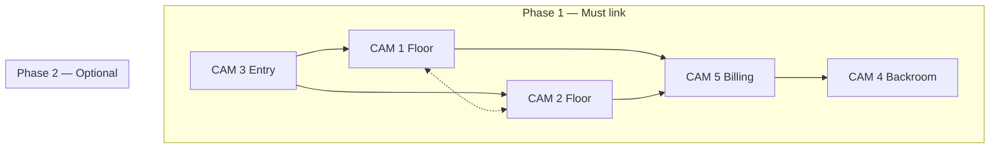
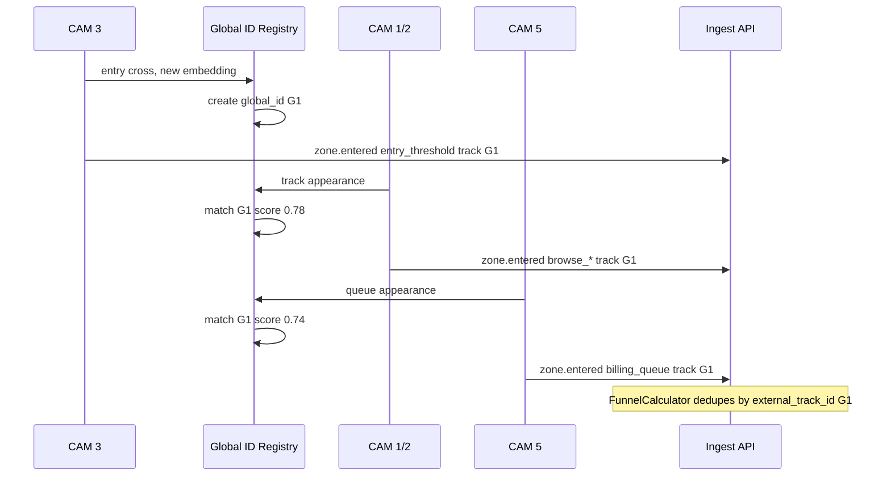

# Re-Identification Strategy — Purplle Pilot Store

Cross-camera person association plan for the five-camera dataset. Aligns with existing session model (`sessions.external_track_id`), funnel deduplication (`dedupe_by_track`), and detection ports (`IDetector`, `ITracker`) — **no API contract changes**.

---

## Goals

1. **Single store visit session** — Link entry (CAM 3) → browse (CAM 1/2) → queue/checkout (CAM 5) under one `external_track_id` where possible.
2. **Staff suppression** — Avoid counting staff as customers in footfall and queue metrics.
3. **Graceful degradation** — ByteTrack IDs are camera-local; global ID is best-effort via Re-ID embeddings + handoff rules.
4. **Privacy-by-design** — Store embedding vectors ephemerally (Redis / worker memory); persist only `external_track_id` string and aggregate events.

---

## Camera graph and handoff priorities

Based on overlap analysis and walk paths (`camera_analysis.md`):



| Handoff | Priority | Max time gap | Max spatial gap |
|---------|----------|--------------|-----------------|
| CAM 3 → CAM 1/2 | **P0** | 120 s | N/A (appearance only) |
| CAM 1/2 → CAM 5 | **P0** | 180 s | N/A |
| CAM 5 ↔ CAM 4 | **P1** (staff) | 300 s | Same doorway |
| CAM 1 ↔ CAM 2 | **P2** | 240 s | Adjacent aisles — weak |

---

## Tracking stack (per CHOICES.md)

| Layer | Technology | Scope |
|-------|------------|-------|
| Per-camera MOT | **ByteTrack** on YOLO person detections | Stable `track_id` within one camera clip/stream |
| Global identity | **OSNet / torchreid** (or CLIP-ReID) 512-d embedding | Cross-camera match in handoff window |
| Session key | **`external_track_id`** in events | `{store_id}:{global_person_id}` or `{store_id}:{cam}:{track_id}` until fused |

### Stub phase (current)

- Emit `external_track_id = f"{camera_id}:{local_track_id}"`.
- No cross-camera fusion — funnel treats re-entry as separate sessions unless same ID string repeats (dedupe).

### Production phase

- Detection worker maintains **Global Identity Registry (GIR)** per store in Redis:
  - Key: `si:reid:{store_id}:{global_id}`
  - Value: `{ embedding, last_seen_at, last_camera_id, local_track_ids: {}, role: customer|staff|unknown }`
  - TTL: 45 minutes (covers re-entry cooldown)

---

## Re-ID feature extraction

### Input crop

- Person bbox from YOLO, expanded 10% padding.
- Minimum height **80 px** at 1080p; skip Re-ID below threshold (too noisy at high angle).

### Model recommendation

| Option | Pros | Cons |
|--------|------|------|
| **OSNet x1.0 (Market-1501)** | Fast, retail-proven | Domain gap on beauty uniform |
| **FastReID + fine-tune** | Best accuracy on pilot clips | Needs labeling pass |
| **CLIP ViT-B/32** | Zero-shot, quick pilot | Heavier, less stable on partial occlusions |

**Pilot default:** OSNet with **cosine similarity threshold 0.65** (tune on held-out clip pairs).

### Auxiliary signals (no extra API fields)

Combine with embedding in worker-only scoring — do not add new event payload keys:

| Signal | Weight | Notes |
|--------|--------|-------|
| Cosine similarity | 0.55 | Primary |
| Time gap inverse | 0.20 | Favor recent handoffs |
| Camera graph edge | 0.15 | P0 edges boost |
| Apparel color histogram | 0.10 | Helps when embedding weak (black staff vs colorful customer) |

**Match rule:** global association if weighted score ≥ **0.72**.

---

## Camera-specific Re-ID considerations

### CAM 3 — Entry / exit

- **Best quality for new global IDs** — create session on inbound threshold cross.
- Full-body visible at door; assign **new global_id** if no match above threshold.
- Outbound crossing closes session segment (dwell in store computed later).
- **Occlusion:** ignore tracks with centroid x > 0.78.

### CAM 1 & CAM 2 — Main floor

- High angle, frequent **partial occlusion** by gondolas and other shoppers.
- Prefer **foot-point tracking** for zone events; use **upper-body crop** for Re-ID (torso + head).
- Consultation interactions cause **static dwell** — do not split track on low motion.
- Staff at consultation desk: short trajectories desk ↔ shelf — classify before merging with customer global IDs.

### CAM 5 — Billing

- **Staff dominate** — two+ people in black behind counter for entire clip.
- Maintain **staff global IDs** seeded from first day manual labels (2–3 templates).
- Customer tracks: short path queue → counter → exit; match to floor IDs within 180 s.
- Counter height causes **lower-body occlusion** — Re-ID on upper body only.

### CAM 4 — Backroom

- Staff-only; links to CAM 5 via doorway.
- Low lighting variance vs sales floor — expect **embedding domain shift**; rely more on time-gap + CAM 5 handoff than appearance alone for CAM 4 ↔ CAM 5.

---

## Staff vs customer classification

No new event types — set `payload.class_label` or worker-internal flag that maps to existing class label metadata (`count_in_footfall: false` for staff).

| Rule | Condition | Label |
|------|-----------|-------|
| R1 Uniform | Upper-body HSV: >70% dark pixels (V < 80) for ≥ 60 frames | `staff` |
| R2 Counter dwell | Centroid in CAM 5 `checkout_staff` > 5 min | `staff` |
| R3 Backroom | Any detection on CAM 4 | `staff` |
| R4 Desk assignment | Repeated CAM 1/2 consultation zone + R1 | `staff` |
| Default | Else | `visitor` |

Staff tracks:

- Do **not** increment footfall on CAM 3 entry.
- Do **not** count toward `billing_queue` depth.
- **Do** emit zone events for heatmap “staff coverage” optional dashboard (phase 3).

---

## Session lifecycle (maps to existing `sessions` table)



### ID format

```
external_track_id = "{store_uuid}:{global_person_uuid}"
```

Until fusion:

```
external_track_id = "{store_uuid}:{camera_uuid}:{local_track_id}"
```

Funnel `dedupe_by_track: true` collapses only identical strings — fusion worker **rewrites** local IDs to global ID on match before ingest (preferred) or emits correction event (phase 2).

---

## Handling ID switches and re-entry

### ByteTrack ID switch (same camera)

- If new local ID overlaps previous bbox IoU > 0.5 within 5 frames, **merge locally** before Re-ID.
- If dwell in same zone continues, keep global ID.

### Customer re-entry (existing funnel rule)

- `reentry_cooldown_minutes: 30` in store config.
- New CAM 3 entry after cooldown → **new session**, even if embedding matches earlier visitor (product requirement).

### Same clip duplicates

- Evening clip shows low traffic — minimal risk.
- Peak hour: NMS across cameras **not** applied in phase 1 (no shared frame).

---

## Overlap-aware deduplication

| Overlap pair | Risk | Strategy |
|--------------|------|----------|
| CAM 1 ↔ CAM 5 (BL) | Same person double-counted in floor + queue | Prefer CAM 5 for `billing_queue`; suppress CAM 1 aisle events when CAM 5 match active |
| CAM 5 ↔ CAM 4 | Staff counted as customer | CAM 4 detections always `staff` |
| CAM 2 ↔ CAM 3 | Entry visitor briefly in both | 30 s fusion window; CAM 3 owns ENTRY event |

---

## Embedding store (worker-internal)

Not exposed via API.

```
Redis hash: si:reid:{store_id}:{global_id}
  embedding: float32[512] serialized
  last_camera_id: uuid
  last_seen_at: iso8601
  role: customer|staff|unknown
  local_tracks: json map camera_id -> track_id
TTL: 2700 seconds
```

Eviction on TTL — historical analytics rely on persisted `events`, not embeddings.

---

## Evaluation plan (pilot dataset)

Use the provided 2.5 min clips before live deploy:

| Test | Method | Pass criteria |
|------|--------|---------------|
| Entry → floor link | Manual count of distinct customers entering CAM 3 vs unique globals on CAM 1/2 | ≥ 80% recall |
| Floor → billing link | Customers visible in queue region | ≥ 70% recall (occlusion expected) |
| Staff exclusion | Staff at CAM 5 counter | 0% footfall increment |
| False merge | Different people same clothing color | < 5% false merge rate |
| Latency | End-to-end per frame | < 120 ms GPU / < 400 ms CPU |

Manual ground truth: label 10–15 individuals across 5 clips (spreadsheet with timestamp, camera, action).

---

## Implementation phases

### Phase 0 — Stub (now)

- `external_track_id = {camera}:{local}` per stub tracker.
- Validates ingest → funnel → heatmap path.

### Phase 1 — Single-camera YOLO + ByteTrack

- Real local tracks; normalized bbox in `vision.track.updated` payload (architecture event).
- Zone analyzer consumes foot point.

### Phase 2 — Cross-camera Re-ID

- GIR in Redis; fusion on P0 edges only.
- Staff classifier rules R1–R4.

### Phase 3 — Fine-tune + POS correlation

- Fine-tune OSNet on 500+ labeled crops from this store.
- Optional: correlate `analytics.purchase.completed` with CAM 5 checkout dwell for PURCHASE stage validation.

---

## Privacy and retention

- Embeddings **not** written to PostgreSQL.
- Event payloads keep `external_track_id` opaque UUID — no biometric storage in DB.
- GDPR purge: delete `events` + `sessions` by tenant; Redis TTL handles ephemeral Re-ID state.

---

## Dependencies (detection worker only)

Not added to API `pyproject.toml`:

```
ultralytics>=8.3
byte-track  # or integrated in ultralytics
torchreid>=0.2.5  # OSNet
opencv-python-headless>=4.8
```

GPU: **NVIDIA T4 or better** for 5× 1080p @ 5 fps sampled processing per store.

---

## Summary

| Camera | Re-ID role |
|--------|------------|
| CAM 3 | **Identity birth** — create global ID on entry |
| CAM 1/2 | **Maintain / match** — browse path |
| CAM 5 | **Match to queue** — conversion signal |
| CAM 4 | **Staff anchor** — backroom correlation |

The existing funnel engine already supports the outcome — this strategy fills the vision worker layer between ByteTrack local IDs and `external_track_id` used in `vision.zone.entered` / `vision.zone.exited` events.
